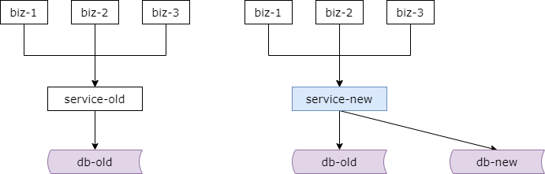
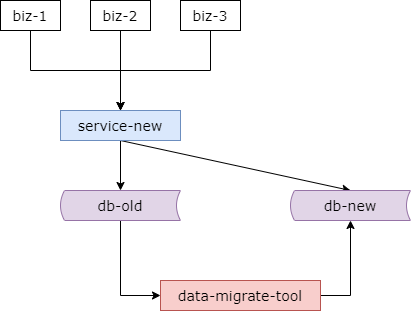
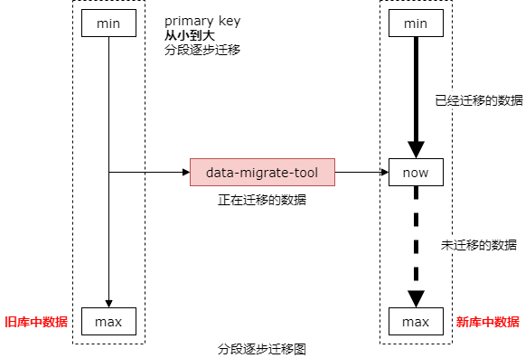
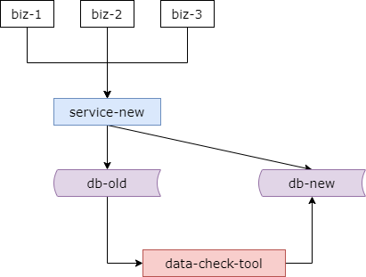
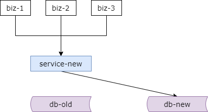

## 25、数据库：扩展性，平滑扩容方案？

### 回顾

**扩展性，解决什么问题？**

（1）底层表结构变更

（2）水平扩展，分库个数变化

（3）底层存储介质变化

**方案一，停服扩展（离线，非高可用）**

（1）挂公告，暂停服务

（2）离线迁移数据

（2）恢复服务

**方案二，pt-online-schema-change（平滑）**

**方案三，追日志方案（平滑）**

（1）升级服务，记录日志

（2）离线迁移数据

（3）追日志，补充增量

（4）校验数据

（5）迁移流量

首先来对上一节进行一个简单的回顾。上一节介绍了扩展性的几个方案。扩展性解决什么问题呢？解决底层表结构变更，水平扩展分库个数变化，以及底层存储介质变化的问题。最常想到的方案是停服扩展的方案，但是它是一个离线并非高可用的方案。我们挂公告停止流量，离线的进行数据的扩展与迁移，最后进行服务的恢复。MySQL 的话可以利用一个相对比较成熟的工具 online schema change 进行表结构的在线扩展。最后介绍了有关非常有意思的方案，叫做追日志的方案，它是一个平滑的高可用的方案，整个方案有五个步骤，第一步升级服务记录一些日志，记录哪个时间哪个库哪个表哪个主键进行的修改操作。第二步离线的进行数据迁移，我们会建立一个新库新表，用一个小工具将数据从旧库旧表中导入到新库新表。第三步追日志补充增量，在迁移数据的过程中旧表中又有很多数据进行了修改，我们需要读取这些数据的修改，把这些数据的修改记录在日志里，并将这些 key 从旧表中读出覆盖到新表，这是一个逐步逼近的过程。第四步进行数据校验，将流量从旧库迁移到新库之前，必须保证新库旧库中的数据是一致的。最后一步迁移流量，服务层微服务层将数据库旧库上的流量迁移到新库中去。如此一来扩展完成，旧表新增属性扩展到新表，或者是水平切分两个库扩展到三个库。

扩展性还有其他方案吗？今天就来和大家介绍一个非常有意思的双写方案。

### 方案四：双写方案（步骤一）

双写方案他也是一个高可用的平滑迁移的过程，这个方案主要分为四个步骤，在方案最终完成之前和追日志的方案一样他依然是旧库对线上提供服务。

步骤一，对服务进行升级，对数据进行修改的写接口，这里的修改主要是对数据进行 insert delete 和 update 操作，在新库上进行相同的操作，也就是说对应的微服务接口，insert 需要旧库和新库同时 insert，delete 需要旧库和新库同时 delete，update 需要旧库和新库同时 update。由于此时新库中是没有数据的，所以对于旧库和新库中的 affected rows 可能不一样。不过这并不影响业务的功能，因为只要你流量不切库，依然是旧库对线上提供服务。

这个服务进行升级的风险非常的小。第一，写接口毕竟是少数接口，改动点会相对比较少。第二，新库中的写操作执行成功与否并不会对业务产生任何影响，因为一直是旧库对线上提供服务。

这是步骤一。

### 方案四：双写方案（步骤二）

第二个步骤我们也是研发一个数据迁移工具，对数据进行迁移，我们要建立新库新表，它可能是一个属性扩展的一个新库新表，也可能是一个两库变成三库的一个新库新表。

这个小工具做的工作也非常非常的简单，就是将旧库中的数据逐步的导入到新库中去。如果是属性的扩展，那么就是旧表读出来，新表插入进去。如果是分库个数的扩展，那么他就是少量库的数据读出来，多量库的数据插入进去。如果是存储介质的变化，那么他就是旧存储引擎的数据读入进来，新存储引擎的数据插入进去。

这个工具的风险是非常非常小的。因为整个过程中依然是旧库对线上提供服务，任何时间发现的问题都可以把新库中的数据干掉重来。也可以慢慢的限速进行迁移，技术同学没有时间限制的压力。

和追日志方案所面临的问题一样，是不是迁移完数据之后就可以切新库，对线上提供服务了呢？答案是肯定的。因为你将双写进行了前置，所以理论上数据迁移完成之后新库中的数据会和旧库中的数据完全的一致。

**数据就一致了吗？**

理论上数据就完全一致了，如何来进行证明呢？

**数据一致性证明**

我们来画一个图证明只要你进行了前置的双写，理论上迁移完数据新旧的数据计算一致的了。

如上图所示，左边的图是旧库中的数据，右边的图是新库中的数据。我们按照主键从小到大分段的对数据进行迁移，限速的分段的按照主键从小到大的进行数据迁移。

假设旧库中主键是从 min 到 max，我们按照这个顺序分段的限速的进行数据迁移。假设已经迁移了前面这一段，也就是说新库中有前面这一段的数据，加粗的箭头号是已经迁移过来的数据。我们来对前置的双写操作进行一个分析。因为在数据迁移的过程中旧库中的数据依然在进行修改，但是这些修改会新库和旧库进行双写，我们了逐步分析 insert 操作，delete 操作，和 update 操作，这些双写对于新库和旧库中的影响，会不会造成数据的不一致。

迁移过程中假设进行了一个双 insert 的操作，新库和旧库中都插入了数据，那么一致性没有被破坏，因为两边的数据都 insert 插入了嘛。

假设迁移的过程中进行了一个双 delete 的操作，那么此时又分为两种情况。第一种情况 delete 掉的数据是已经迁移过去的数据，已经迁移过去的数据进行了双 delete 的操作，所以新库和旧库都没有这条数据，数据仍然是一致的。那假设删除的数据是没有迁移过去的数据，那么进行双 delete 操作，对于旧库中删除操作的 affected rows 是 1，对于新库中删除操作的 affected rows 是 0，因为数据还没有迁移过去嘛。但是数据迁移工具迁移到后续并不会将这个旧库中的数据迁移过去，因为已经被删了嘛，所以数据的一致性仍然没有被破坏。

至于 update 的操作，你可以认为是一个 delete 操作叠加一个 insert 操作的复合操作，所以数据仍然是一致的。

不知道表达清楚没有，旧库中有全量的数据，实时的在进行修改，新库中只有部分数据，也是实时的在进行双写的修改。新增操作两边都 insert，一致性不会变化。删除操作，如果删除的是已经导过去的数据，两边都进行删除，一致性不会被破坏，如果删除的是未导过去的数据，那么这条数据后续在迁移的过程中不会被导过去，所以一致性也没有被破坏。

只要你提前进行双写，只要迁移完数据，理论上旧库和新库中的数据就是完全一致的。除非除非在一种非常极限的情况下，迁移数据的工具刚从旧库读入了一条数据，读入了一小段数据，这一小段数据恰巧发生了一个新库和旧库中的删除操作，删除操作完迁移数据将这些数据又插入到了新库中，在非常非常极限的情况下才可能出现，这种不一致会导致新库中比旧库中可能会多了几条数据。

### 方案四：双写方案（步骤三）

无论如何为了保证数据的一致性，在切库之前我们仍然是进行数据的比对。也就是步骤三。

迁移完数据之后我们还是要研发一个数据校验的小工具来将旧库和新库中的数据进行对比，发现是否符合预期。如果步骤二中真的存在极限的情况，新库比旧库多了几条数据，那么此时一旧库中的数据为准，一将新库中的那小段数据给删除。

数据检测工具的风险非常的小，因为整个切流量之前依然是旧库对线上提供服务的。工具的复杂性低，发现问题仍然随时可以回滚。限速比对数据对技术的同学没有时间限制的压力。

### 方案四：双写方案（步骤四）

最后一步，比对成功之后，我们将数据库上的流量从旧库迁移到新库。整个过程中能够持续的对线上提供服务，不影响服务的可用性。

至此我们升级完毕，完成了升级的平滑扩展。

数据库水平切分的平滑扩展以及底层表结构的变更或者底层存储引擎的一个迁移。这个方案是不是有的意思。

### 总结，追日志方案 vs 双写方案

**追日志方案：**

（1）**服务升级**，记录“数据修改”的日志；

（2）迁移数据**小工具**，进行数据迁移；

（3）追日志**小工具**，追平数据差异；

（4）数据校验**小工具**，校验数据一致性；

（5）**切流量**到新库，完成平滑迁移；

**双写方案：**

（1）**服务升级**，“数据修改”双写；

（2）迁移数据**小工具**，进行数据迁移；

（3）数据校验**小工具**，校验数据一致性；

（4）**切流量**到新库，完成平滑迁移；

上一章介绍了追日志的方案，这一章介绍了双写的方案，两种非停服方案都需要对系统进行升级，都需要研发一些小工具，我们来对这两种方案进行一次简要的对比。

追日志方案服务升级它会记录数据修改的日志，双写方案服务升级他会记录数据修改的双写，所以你会发现他要升级的点是相同的，只是说前者是记录日志，后者是进入双写。

追日志方案需要研发三个小工具，迁移数据，追日志和数据校验。双写的方案研发两个小工具，迁移数据和数据校验。而且这些小工具的代码其实都是一样的。

追日志的方案最后切库，双写的方案最后也是切库。

最后都完成了数据的平滑迁移。

然后这两种方案都需要对服务进行升级，都需要研发小工具，整个周期也是相对比较长的，那么也没有一种方案能够完成水平扩展的秒级扩容呢？其实是有的，下一章来和大家进行分享。