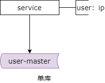
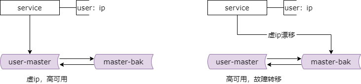
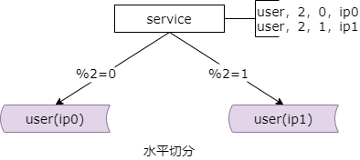
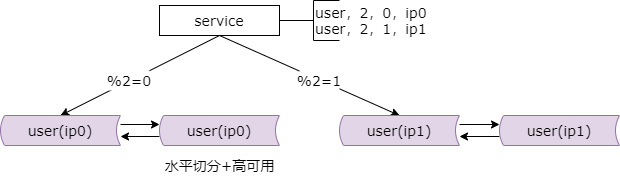
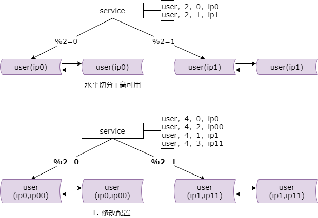
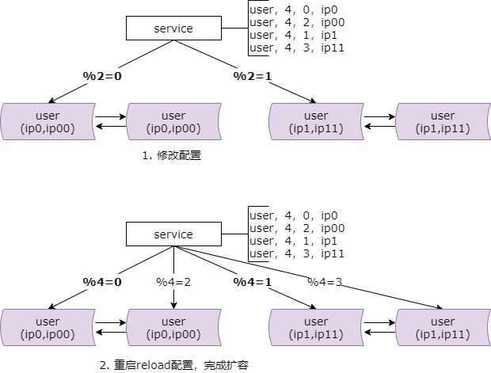
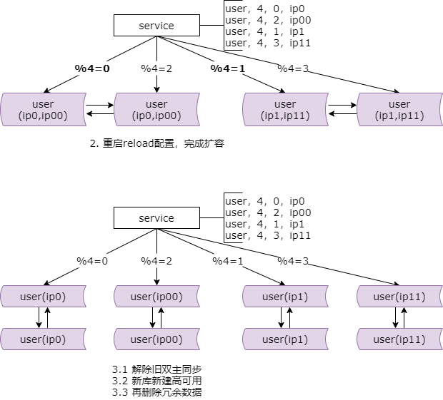
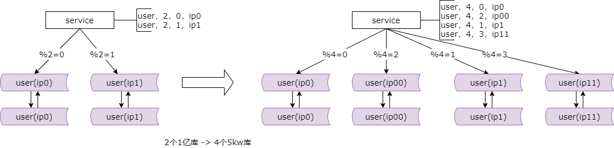

## 26、数据库：水平切分，数据库秒级扩容！

先回顾一下，高可用，水平切分的数据库集群架构

### 回顾一：微服务屏蔽数据库复杂性

首先第一，一般来说并发量大，吞吐量大的互联网分层架构，数据库的上层都有一个微服务层，微服务他会记录业务库与业务（库）实例的映射关系，并通过数据库的连接池访问数据库，路由 SQL 语句。

如上图所示，服务层会配置用户库，user 库对应的数据库实例的 ip，其实是一个内网域名，更多的时候。

### 回顾二：通过冗余 + 自动故障转移，保障高可用

第二点，数据库集群会通过冗余加自动的故障转移来保证高可用。数据库的高可用很常见的一种方式是通过虚 ip 加 keepalived 的方式来进行的。两个相互同步的主库，使用相同的虚 ip，只有一个主库对线上提供服务，当主库挂掉的时候，虚 ip 自动的漂移到另外一个主库，整个过程对微服务的调用方是透明的。通过这种方式来保证数据库的高可用，这个在前面的章节也简单的介绍过。

### 回顾三：通过水平切分，扩充数据量，增加写实例个数

当数据量非常大的时候，数据库集群是通过水平切分来扩充数据量的，来增加读写实例个数的。随着数据量的增大，数据库要进行水平切分，分库之后会将数据发布到不同的数据库实例，甚至物理机上，以达到降低数据量，增强读写性能的目的。

如上图所示，用户库 user 库他发布在两个实例上 ip0 和 ip1，服务层通过配置取模来进行路由，模 2 余 0 的路由到 ip0，模 2 余 1 的路由到 ip1，。

### 综上三点，大数据量，高并发量，微服务的架构

综上三点所述，大数据量，高可用，互联网微服务分层架构，他的数据库与微服务的架构是这个样子的。他既有微服务层来对上游屏蔽底层分库分表，数据库高可用的复杂性。又有水平切分来进行数据的水平扩展以及读写实例个数的增加。以及每一个读写实例又都做了高可用。所以实际线上的服务集群是这个样子的。

### 会碰到什么问题？秒级扩容解决什么问题？

如果此时数据量持续的增大，两个分库性能扛不住了该怎么办？此时我们需要进行持续的水平切分，拆分成更多的库，降低单库的数据量，增加读写实例的数量来提高读写的性能。现在是两个实例进行读写服务，两个实例来进行数据存储，能不能进一步的增加实例并降低单库的数据量呢？我们后续的方案是假设数据库的实例成倍的扩容，这个过程中能不能平滑迁移，持续对外提供服务，保证服务的可用性，并在秒级完成呢？

数据库秒级平滑扩容方案，三步走

### 步骤一：修改配置

第一个步骤，修改配置。最初的配置是这个样子的，两个实例提供服务，做了虚 ip0 和虚 ip1，模 2 余 0 的路由到这个实例，模 2 余 1 的路由到这个实例。

修改哪些配置呢？主要修改两处配置。

第一处，在数据库原有的实例做双虚 ip。原来你只做了虚 ip0，你现在要做虚 ip0 和虚 ip00 的双虚 ip。另外一组做虚 ip1 和虚 ip11 的双虚 ip。这是第一个要修改的配置。

第二个要修改的配置是服务的路由配置。原来的服务路由是模 2 余 0 到虚 ip0，模 2 余 1 到虚 ip1，现在变成模 4 余 0 到虚 ip0，模 4 余 2 到虚 ip00，模 4 余 1 到虚 ip1，模 4 余 3 到虚 ip11。由于它是成倍的扩容，模 4 余 0 和模 4 余 2 的部分其实对应之前的模 2 余 0 的部分，也就是说修改完路由之后，理论上能够找到原来的数据，数据路由不会发生异常。模 4 余 1 和模 4 余 3 的部分对应原来的模 2 余 1 的部分，所以数据路由也不会发生异常。

用这种方案的必须成倍的来进行扩容。修改双虚 ip 的配置，以及路由的配置。此时由于你的微服务没有 reload 新配置，所以依然还是模 2 来对线上提供服务的。

### 步骤二：reload 配置完成扩容

服务层 reload 配置会变为按照新的配置来路由数据，模 4 余 0，模 4 余 2 对应原来模 2 余 0 的部分，模 4 余 1，模 4 余 3 对应原来模 2 余 1 的部分。

reload 配置的过程，可能有这么几种方式。比较原始的重启服务，读新的配置文件。比较高级一点的配置中心给服务层发信号，让他重新读取配置文件，初始化数据库连接池。不管哪种方式 reload 之后数据库实例的扩容就完成了。原来是 2 个实例对线上提供服务，现在你会发现已经 4 个实例对线上提供服务了。

这个 reload 的过程一般可以在秒级完成，即使逐步的重启对服务的正确性和可用性也是完全没有影响的。刚刚说了数据路由仍然能够找到相关的数据，模 4 余 0 和模 4 余 2 的部分你会发现还在进行双向的同步，这个双向的同步不会发生数据不一致，因为一个库与另外一个库进行变更是没有交集的。

这一步只完成了实例的扩展，但每一个分库的数据量并没有下降，所以第三个步骤我们还需要进行一些收尾的工作。

### 步骤三：数据收缩，完成收尾

我们需要进行一些什么收尾的工作呢？你会发现实例扩展之后，我们失去了数据库的高可用特性，所以我们需要做几件事情。

第一件，解除旧的双主同步。旧的双主同步是两个实例对线上提供服务的高可用保障，你现在四个实例了，这样可能并不能保证高可用。第一步解除旧的双主同步。

第二步，新增新的双主同步。新的双主同步，建虚 ip，keepalived，是保证实例高可用的。那么新的这两个实例做虚 ip0，余 2 的做虚 ip00，这边做虚 ip1，余 3 的做虚 ip11。

第三步，删除冗余的数据。原来这边是模 2 的数据，现在他只对模 4 余 0 进行服务了，所以要将模 4 余 2 的部分的数据删除，第二个实例将模 4 余 0 的部分删除，第三个实例将模 4 余 3 的部分进行删除，第四个实例将模 4 余 1 的部分进行删除。到达这一步，数据库的实例的单实例的数据量也进行了减半。

### 最终达成什么效果？

最终我们达成的效果是原来两个实例对线上提供服务，现在我们 double 了，有四个实例对线上提供服务。原来我们每个实例的数据存储量，假设是一亿，扩容完成之后，每个实例的存储量是五千万，也就是说数据量减半了。并且数据库依然能够保证高可用，同时整个迁移过程秒级完成平滑过渡，业务无损。这个方案帅气不帅气。

### 总结，数据库水平切分，秒级成倍扩容

**互联网大数据量，高吞吐量，高可用微服务分层架构**

**数据库实现秒级平滑扩容的三个步骤为**：

（1）修改配置（双虚 ip，微服务数据库路由）；

（2）reload 配置，实例增倍完成；

（3）删除冗余数据等收尾工作，数据量减半完成；