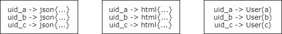
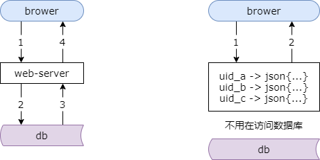
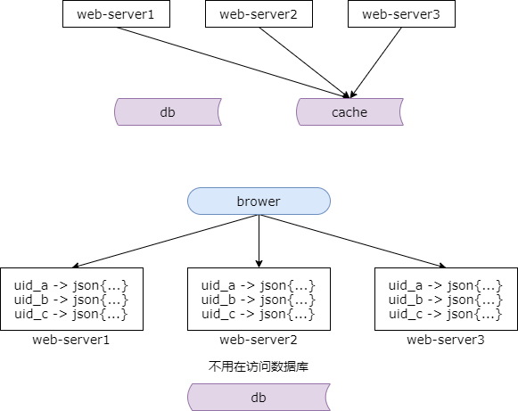
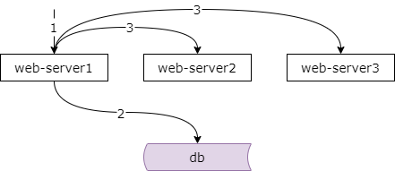
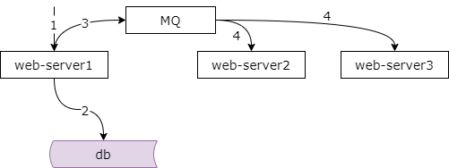
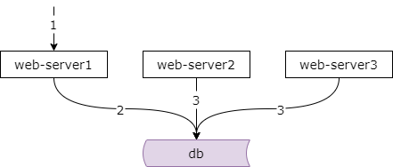

### 27、缓存：进程内缓存要怎么玩？

#### 什么是进程内缓存？

例如：

（1）带锁的 Map

（2）leveldb

缓存除了常见的 redis memcache 等进程外缓存服务之外，还有一种常见的玩法，就是进程内缓存。它是将一些数据缓存在站点或者服务的进程内。

进程内缓存的实现载体，最简单的它可以是一个带锁的 map，又或者它可以使用第三方的库，例如 leveldb 来实现进程内的缓存。

#### 进程内缓存能存储什么？

**缓存服务能存储的，它都能存**：

（1）json

（2）html

（3）object

例如，我们可以存储 json 数据，uid a，uid b，uid c，对应的 json 数据。我们可以缓存 html 页面，在站点层经常做页面缓存，请求过来直接返回页面，访问速度非常的快。更多的，我们可以缓存对象，用户 a uid a 他的对象实体，uid b 他的对象实体，uid c 他的对象实体。总之，缓存集群能够缓存什么，进程内缓存他就能够缓存什么。

#### 进程内缓存，有什么好处？

##### 进程内缓存 vs 没有缓存

进程内缓存与没有缓存相比读取数据大部分的请求不需要访问后端。如图所示，如果没有缓存，每次都需要通过数据库去访问数据。如果有了进程内缓存，绝大部分的请求不需要通过数据库去访问数据，进程内的数据就能够直接的访问，进程内的数据就能够直接的返回前端了。

##### 进程内缓存 vs 缓存集群

优点：

（1）节省内网带宽

（2）时延更低

进程内缓存与缓存集群相比他的优势是进程内缓存省去了网络开销，所以一来节省了内网带宽，二来响应时延会更低，速度会更快。

#### 进程内缓存，有什么不足？

##### 进程内缓存 vs 缓存集群

最被人诟病的是他的一致性难以保障。

统一的缓存服务虽然多了一次网络交互，但他仍然是后端的统一存储。如上图所示，站点和服务中的多个节点访问统一的缓存集群，数据统一存储，容易保证数据的一致性。因为这个数据只存在了这一个缓存的地方。

而进程内的缓存，如图所示，多个节点，多个站点或多个服务的内存节点都会存储数据，数据会分布多份，所以一致性保障会比较难。之前介绍一致性的时候我们都说过，数据的冗余一定会带来一致性的问题，因为多处冗余的数据并不是同时修改的。进程内缓存就是这样。数据在进程内，站点或服务的多个节点冗余了多份，它们并不是同时修改的，所以可能有一致性的问题。

#### 如何保证进程内缓存一致性？

常见的方案有三种。

#### 方案一：单节点通知其他节点

第一种方案，可以通过单节点通知其他节点。如上图所示，写请求发生在了 server1，他修改完自己内存数据与数据库中的数据之后，可以主动的通知其他节点修改自己内存的数据。

这种方案的缺点是，同一功能在一个集群的多个节点相互耦合在一起，特别是节点比较多的时候，连接关系会相对比较复杂。节点之间耦合。

#### 方案二：MQ 解耦，通知其他节点

为了解除耦合，方案二，我们可以通过 mq 来通知其他节点。如上图所示，当写请求发生在 server1 的时候，他修改完自己的内存数据和数据库中的数据之后，发送请求给 mq 来扩散数据的变化通知，其他的节点订阅 mq 消息，也修改自己内存的数据。

这种方案虽然解除了节点之间的耦合，但引入了 mq，使得系统更加的复杂。

前面两种方案都是节点数量越多，数据冗余的份数越多，数据更新的原子性越难保证，一致性也就越难保证，这就引出了方案三。

#### 方案三：放弃实时一致性，定期从后端更新数据

方案三为了简化系统，为了避免耦合，为了降低系统的复杂性，干脆就放弃了实时的一致性，每个节点启动一个 timer，定时的从后端拉取最新的数据，更新内存的缓存。

当有节点实时的更新后端数据时，其他的节点还没来得及通过 timer 更新数据，此时访问到其他节点的请求会读到内存缓存的脏数据。这就意味着使用这种方案必须一定程度上接受读旧数据。

#### 为什么不能频繁使用进程内缓存？

**违背了“站点无状态，服务无状态”的设计准则。**

一致性是内存缓存存在的最大的问题，所以我们其实并不能频繁的使用内存的缓存。这是为什么呢？

分层架构设计有一条准则叫做站点层服务层尽量要做到无状态，这样才能任意的增加节点，实施水平的扩展。数据和状态尽量存储到后端，统一存储，例如数据库服务或者是缓存服务。

所以可以看到站点与服务进行进程内的缓存实际上违背了分层架构设计的无状态准则，所以一般情况下不推荐使用。

#### 什么时候可以使用进程内缓存？

可以考虑的场景：

（1）只读数据

（2）并发极高，透传后端压力极大

（3）允许一定程度上数据不一致

在以下情况下可以考虑使用进程内缓存。

情况一，只读数据，可以考虑在进程启动时将数据加载到内存，使用进程内缓存。当然，此时也可以把数据加载到 redis 或者是 memcache 的缓存服务，也能够满足这一类需求。只是多了一次内网的交互而已。

情况二，并发量极高的业务场景，如果将请求透传到后端，压力会非常非常的大，这个时候可以考虑使用进程内缓存。例如典型的是秒杀类业务，他的并发量非常的高，需要在站点层挡住流量，这个时候你可以使用进程内缓存。

情况三，有一些业务在一定程度上允许短时间内的数据不一致。典型的业务场景是计数业务。比如说某一些业务我们要计数，某一些 url，某一些用户他的访问次数，转发次数，点赞次数，他需要进行计数，这一类的业务并发非常的高，并且短时间内允许一些计数的不一致，对页面的一致性，对数据的一致性的要求相对比较低，此时可以考虑使用进程内的计数缓存，进程内的页面缓存等等。

**再次强调**：

**（1）不要为了炫技，而使用进程内缓存；**

**（2）大部分场景，请使用缓存集群（redis/memcache）；**

总之，再次进行强调进程内的缓存他的适用场景并不如缓存集群，redis memcache 那么广泛，所以一定不要为了炫技而使用进程内的缓存，只会给自己带来更多的问题。绝大部分的场景我们还是老老实实的使用 redis 和 memcahce。如果不是上面的三种业务场景，可能你未必适合使用进程中的缓存。

#### 总结，进程内缓存

**优点**：

（1）节省内网带宽

（2）时延更低

**不足**：一致性难以保证

**保证一致性的方法？**

（1）单节点通知其他节点

（2）MQ 解耦，通知其他节点

（3）放弃实时一致性，定期从后端更新数据

**什么场景适用？**

（1）只读数据

（2）并发极高，透传后端压力极大

（3）允许一定程度上数据不一致