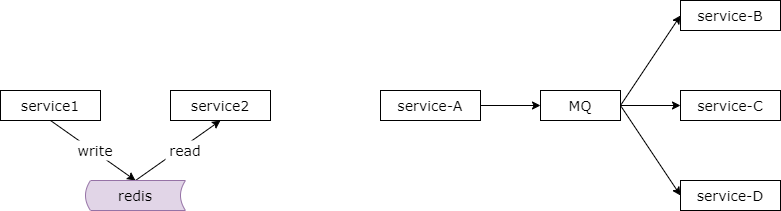
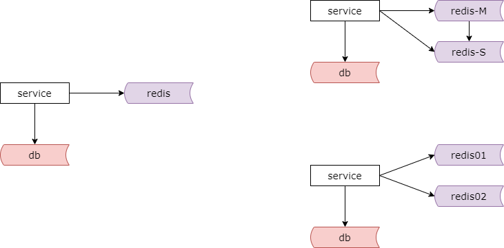
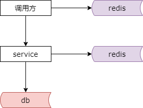
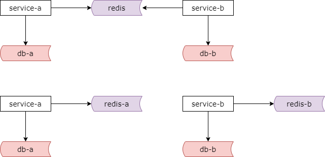

### 28、缓存：很多时候我们都用错了！

大家都使用缓存，但是很多时候我们用错了缓存，今天来和大家介绍四种典型的误用了缓存的业务场景。

#### 误用一：把缓存作为服务与服务之间传递数据的媒介

如上图所示，服务一和服务二约定好了 key 和 value（格式），通过缓存传递数据。服务一将数据写入缓存，服务二从缓存读取数据，达到两个服务通信的目的。不知道有没有同学是这么用的啊？

这是一个数据管道的场景。如果只是将缓存作为数据管道，其实此时 mq 比缓存更加的合适。

多个服务关联同一个缓存实例会导致服务之间的耦合。服务一和服务二因为读写同一个缓存，它们耦合到了一起，它们要彼此协商 key 的格式，它们要彼此依赖于同一个缓存的服务地址，如果缓存发生变化，多个服务节点都要发生变化。因为一处变化引发多处变化，这是一个典型的耦合。

mq 在这个业务场景中是更加合适的。mq 它能够支持 push（推送），而 cache 他只能支持拉取。

mq 天然的支持集群，支持高可用，支持数据落地，而 cache 只是简单的将数据存储在内存里，他具备“易失性”。当然有些 cache 支持落地。但互联网技术选型的原则是让专业的软件干专业的事情。nginx 做反向代理，db 做固化，cache 做缓存，mq 做数据通道。因此这个场景里 mq 显然是更加适合的选型。

#### 误用二：使用缓存未考虑雪崩

常规的缓存玩法，如上图所示，服务会先读缓存，如果命中则返回，如果不命中则从数据库中读取数据并把数据放到缓存里，以便下次读取命中缓存。

什么时候会发生雪崩？当缓存挂掉，所有的请求都压到数据库，如果没有提前做容量预估，可能把数据库压垮，在缓存恢复之前，数据库可能一直都起不来，导致整个系统不可用，这就是所谓的雪崩。

如何来应对雪崩呢？如果可能出现雪崩，我们需要做进一步的设计。

常见的的解决方案一，缓存高可用。如上图所示，使用高可用的缓存集群，当一个缓存实例挂掉之后能够自动的做故障转移，而不会压垮数据库。

常见的方案二，缓存做水平切分。缓存实施水平切分之后，一个缓存实例挂掉也不至于所有的流量都打到数据库上，以此来保护数据库。

缓存高可用和缓存水平切分是使用缓存当可能出现雪崩的情况就要用这两种方案来应对。

#### 误用三：调用方缓存数据

如上图所示，服务方对上游提供服务，实施了缓存，向调用方屏蔽数据获取的复杂性，而调用方他可能自己也缓存了一份数据。调用方他会先读自己缓存的数据，再根据结果来决定是否调用下游的服务。不知道大家有没有在调用方使用过缓存呢？这也是一种典型的误用。

该方案存在的问题是，调用方需要关注数据获取的复杂性。更严重的是，当服务修改了 db 里的数据，淘汰了服务关联的缓存之后，难以通知调用方去淘汰他自己缓存里的数据，从而导致缓存里的数据和服务下游数据库与缓存里的数据不一致。

有人说服务可以通过 mq 的方式通知调用方淘汰数据。如果加入了 mq，不但系统变得复杂了，还出现了反向依赖，被调用方的下游理论上不应该依赖上游调用方。分层架构设计不是这么玩的。分层架构设计是调用方依赖于服务方，服务方依赖于缓存和数据库，而不应该由底层的微服务层依赖于上游的调用层。所以反向通知是更加不合理的。

#### 误用四：多实例共用缓存

误用一是服务于服务之间通过缓存传递数据这种情况。误用四并不是服务之间通过缓存传递数据，而是为了节省缓存实例个数，多个服务共用一个缓存实例。

如上图所示，服务 a 和服务 b 共同依赖一个缓存实例。那么该方案潜在的问题是，他可能导致 key 冲突，彼此冲掉对方的数据。我们很多时候用缓存，他可能使用用户 id，订单 id，支付 id 来作为缓存的 key，如果多个服务共用一个缓存，可能会彼此冲掉对方的 key。服务 a 和服务 b 的耦合，它们依赖于同一个缓存实例，依赖于共同约定的一些规则，当缓存实例发生变化的时候会引发多个上游的变化。这也是不合理的。

而且不同服务对应的数据量，吞吐量是不一样的，共用一个实例容易导致一个服务把另外一个服务的热数据给挤出去。共用一个实例其实于微服务架构的数据私有的设计原则是相悖的。之前介绍微服务的时候我们说过微服务的架构它有一个特点叫做数据私有，数据库也是私有的，缓存也是私有的，任何的调用方不能够越过微服务的 rpc 接口去调用它底层的数据。如果共用缓存实例，则违背了微服务的底层设计原则。那如果你能够绕过微服务去访问缓存，那能不能绕过微服务去访问他底层的数据库呢？显然是不行的。

所以建议的方案是，如下图所示，各个微服务私有化自己的数据，不管是数据库的数据，还是缓存的数据。向上游屏蔽底层数据获取的复杂性，微服务与微服务之间都私有化数据，彼此解耦。

#### 总结

（1）服务于服务之间不要通过缓存传递数据

（2）如果缓存挂掉，可能导致雪崩，此时要做高可用缓存，或者水平切分

（3）调用方不宜再单独使用缓存存储服务底层的数据，容易出现数据不一致，以及反向依赖

（4）不同服务，缓存实例要做垂直拆分，不宜共用缓存