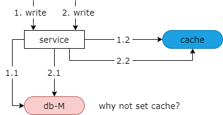

### 29、缓存：互联网最佳实践！

#### 缓存一般为 kv 结构，value 一般存储什么数据？

（1）朴素类型的数据，例如：int

（2）序列化后的对象，例如：User 实体，本质是 binary

（3）文本数据，例如 json 或者 html

第一，朴素类型的数据，例如，用户 id，用户余额的信息。第二，序列化后的对象，比如说用户实体，他的本质是一个二进制流。第三，文本数据，例如 json 或者 html，他的本质是二进制文本数据。

#### 对缓存中存储的数据，一般任何使用？

**互联网最佳实践：Cache Aside Pattern**

#### Cache Aside Pattern

（1）读实践

（2）写实践

- 淘汰 vs 修改
- 写实践：数据库 first vs 缓存 first

Cache Aside Pattern 又包含缓存的读实践与写实践。写实践又分为了淘汰缓存和修改缓存，以及先操作数据库还是先操作缓存的两类实践。

#### （1）读实践

首先，我们先来看一下读实践。

**Cache Aside Pattern 读实践**

对于 cache aside pattern 读实践应该先读 cache 再读 db。如果 cache hit 则直接返回数据，如果 cache miss 则访问 db 并将数据写回缓存。

如上图所示，第一步，先尝试从 cache 中获得数据，如果 cache miss 了。

第二步，读取数据库的从库。数据库做了主从同步读写分离的架构。

第三步，将数据库中读取的数据写回到缓存，以便下一次请求能够命中缓存。

这是 cache aside pattern 的读实践。

#### （2）写实践

对于写实践。我们先来看一下淘汰和修改缓存的差异是什么？

淘汰 cache 中的某一个 key，操作简单直接将 key 设置为无效，但下一次该 key 的访问会 cache miss。

如果修改某一个 key 的内容，逻辑相对复杂，但下一次该 key 的访问仍然会 cache hit。

可以看到淘汰和修改缓存仅仅有一次 cache miss 的差异。

如果要修改，一般如何进行？

（1）朴素类型

（2）序列化后的对象

（3）文本数据

对于朴素类型的数据，直接修改缓存即可。

对于缓存中存储的序列化后的对象，一般先需要获取数据，反序列化成对象，修改（对象）其中的成员，再序列化为二进制，再写回缓存。

对于二进制类的 json 或者 html 数据，一般也先需要 get 文本，解析成 dom 树对象，修改相关的元素，再序列化为文本，最后写回缓存。

这里的结论是，对于对象类型或者文本类型，修改缓存 value 的成本非常的高，一般选择直接淘汰缓存。对于朴素类型的数据，究竟是修改缓存还是淘汰缓存呢？仍然需要视情况而定，如果修改的代价过高，例如你要访问几次数据库才能得到修改后的结果，仍然应该直接选择淘汰缓存。

**Cache Aside Pattern 写实践**

所以对于 cache aside pattern 缓存的写实践他有两个要点。

第一个要点是，使用淘汰缓存，而不是更新缓存。

第二个要点是，一般先写数据库，再淘汰缓存。

如上图所示，第一步我们要操作数据库。第二步我们要操作缓存。操作缓存我们采用 delete 淘汰的方式，而不是 set 更新的方式。

#### 为什么建议淘汰缓存，而不是更新缓存？

原因是，如果更新缓存，在并发写时可能出现数据不一致。如上图所示，假设我们采用 set 缓存，也就是写回缓存，当操作一和操作二两个并发写发生时，由于无法保证时序，此时，不管是先操作缓存还是先操作数据库，都有可能出现请求一先操作的数据库，请求二后操作数据库，请求二先操作了缓存，请求一才操作了缓存，那么请求二 set 了一个新值，请求一 set 了一个旧值，就会导致数据库中是最新的数据而缓存中是旧的数据。所以根据 cache aside pattern 的建议我们采用 delete 缓存而不是 set 缓存。

如果是 delete 缓存，那么请求一的写操作和请求二的写操作，不管谁先谁后，操作缓存都是一个 delete 操作，不会出现数据的不一致。

这就是为什么 cache aside pattern 建议淘汰缓存而不是更新缓存。

#### 为什么建议先操作数据库，而不是先操作缓存？

cache aside pattern 解释到，如果先操作缓存，在读写并发时有可能出现数据不一致。如上图所示，如果我们先操作缓存，在请求一写请求和请求二读请求发生并发时，由于无法保证时序，可能出现以下的异常时序。

第一步，先发生写操作。写操作的第一步我们先删除缓存中的 key。然后第二步，我们操作的数据库，此时数据库的主从同步第三步并没有完成，然后发生了并发读请求。第一步读取缓存，此时缓存已经被写请求的删除操作删除，于是他会 cache miss。第二步读请求我们会读数据库的从库，但由于主从同步尚未完成，所以读到是一个旧数据。然后第三步读请求中的第三步将旧数据写回了缓存，此时主从同步完成。于是数据库中出现了一个新数据，而缓存中出现了一个旧数据，所以根据 cache aside pattern 的建议，应该先操作数据库再删除缓存，而不是先删除缓存再操作数据库。

#### 总结

（1）**互联网缓存最佳实践**：Cache Aside Pattern

（2）**读实践**：先缓存，命中返回，未命中读数据库，再设置缓存

（3）**写实践**：淘汰缓存而不是修改缓存，先操作数据库，而不是先淘汰缓存