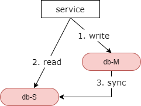
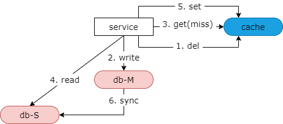
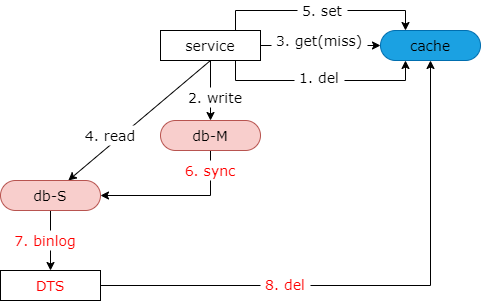

### 30、缓存：一致性优化！

#### 什么时候会不一致？

**数据库，主从不一致**

要聊缓存不一致我们得先从没有缓存时数据库主从不一致的情况说起。如上图所示，发生的场景是，写后立即读。

第一步，主库发生了一个写请求。此时主从同步没有完成。

第二步，从库接着来了一个读请求，读到了旧数据。

最后，主从同步才完成。

导致的结果是，在主从同步之前会读到旧数据。可以看到主从不一致影响的时间很短。第三步主从同步完成之后所有从库上的读请求会读到新的数据。

**数据库与缓存不一致**

再来看一下当引入缓存之后缓存和数据库不一致的问题。如上图所示，也是一个写后立即读的场景。

第一步和第二步也是先发生了一个写请求，我们会删除掉缓存中的数据并且修改数据库。接着第三步、第四步、第五步立刻发生了一个读请求。读缓存，由于缓存中的数据被写请求淘汰掉，此时会 cache miss。接着会读从库，但此时主从同步并没有完成，会读到一个旧数据。然后第五步会把这个旧数据写回缓存，以便后续的读能够 cache hit。最后主从同步才会完成。此时，写后立即读导致的结果是，旧数据进入了缓存，即使主从同步完成，后续的读请求仍然会从缓存里一直读到一个旧数据。

#### 为什么会不一致？

**根本上，数据冗余必将引发数据一致性问题！**

主库与从库的冗余会引发主从一致性问题。主库与主库高可用的冗余会引发主主一致性的问题。数据库与缓存本质也是数据的冗余并将引发数据库与缓存不一致的问题。

可以看到这里提到的缓存与数据库的不一致根本上来说是由数据库主从不一致引起的。当主库上发生写操作之后，从库 binlog 同步的时间间隔内读请求有可能导致旧数据入到缓存里。假设主从不一致的问题没有办法彻底解决，引入缓存之后 binlog 同步时间间隔内也无法避免读到旧数据。

#### 如何优化？

**思路：在从库同步完成之后，如果有旧数据入缓存，应该及时把这个旧数据淘汰掉。**

#### 方案一：二次淘汰法

（1）异步

（2）服务

我们的方法论是，二次淘汰法。他又分为异步二次淘汰法与服务二次淘汰法。这里我们先介绍异步二次淘汰法。

如上图所示，写后立刻读导致缓存中写入了脏数据之后，第六步主从同步完成。我们增加一个异步的第七步，通过工具订阅从库的 binlog，这里能够最准确的知道从库已经完成了数据的同步。本图画的订阅工具是 dts，也可以使用 canal，也可以自己订阅和分析 binlog。在订阅到从库的 binlog 之后，新增第八步，从库再执行一个异步的淘汰缓存的动作。如果这段时间有脏数据写入缓存，第八步能够将这段时间写入缓存的旧数据再次被淘汰掉。如此这般至少可以保证引入了缓存之后主从不一致不会比没有引入缓存更坏。如果你么有第七步和第八步，可能导致脏数据一直在缓存里，而主从的不一致只会有一个小的间隔的不一致。引入了第七步和第八步之后，最多缓存中的脏数据和主从时延脏数据的时间间隔是相同的，它不会比原来更坏。

当然，异步淘汰也可以发生在服务里。在写操作发生时，服务淘汰缓存中的数据之后，假设主从同步的时延是 500 毫秒，服务启动一个 timer，在 500 毫秒之后再次向缓存发起一个二次淘汰。如果这段时间有脏数据入缓存，服务有机会二次淘汰，将旧数据从缓存中剔除掉。

不管是使用线下异步二次淘汰，还是服务二次淘汰，最终缓存中不会再有脏数据写入。

#### 方案二：为允许 cache miss 的场景，设定超时时间

对于允许 cache miss 的场景，我们一般会为对应的 key 值设置一个超时时间，例如 24 小时，而不会设置永久不过期，以便于在极限情况下即使有脏数据入缓存，我们有机会将脏数据纠正过来。

#### 总结

（1）**数据库主从，何时不一致？**写后立即读，短时间内，读旧数据

（2）**数据库缓存，何时不一致？**写后立即读，短时间内，旧数据入缓存

（3）**优化思路**：如果有旧数据入缓存，应该及时把这个旧数据淘汰掉

（4）**优化方法**：

* 二次淘汰法（异步，服务）
* 设定超时时间，有机会纠正