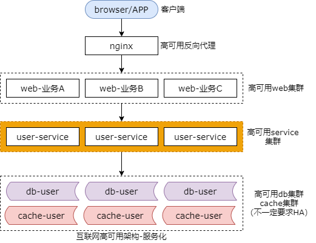

## 33、本章小结：千万流量，这些技术够用了！

### 千万流量是个什么概念？

千万流量是个什么概念？算下来每秒钟大概几百个请求。在这个阶段，只要把服务化分层，数据库，缓存，玩到极致，基本上能够搞定。让我们简单的看一下这个阶段服务化，数据库，缓存要分别怎么玩？相当于是对这一个章节做一个简要的总结。

### 服务化

首先，我们来看一下服务化。

服务化有什么好处？

最开始的时候是没有高可用、服务集群的，由高可用的站点集群直接调用底端的数据库集群。引入服务层，能够提升复用性，消除代码拷贝，保证专注性，防止复杂性扩散，能够解除公共库之间的耦合，能够保证 SQL 的高质量，同时保证了数据库的扩展性，消除了数据库之间的耦合，同时提升了研发效率，让调用方就像调用本地函数一样去调用一个远端的服务。服务化好处多多。

### 微服务粒度，怎么样最合适？

前面的章节分享了四种实践，分别是：统一一个服务层，一个子业务一个服务层，一个库一个服务，一个接口一个服务。互联网的最佳实践是，每一个子业务一个服务。比如说微信业务中的用户服务，好友服务，群组服务，消息服务，他就是一个典型的按照子业务来服务化的一个颗粒度。

### 微服务，高可用，必须考虑

**方法论：集群冗余 + 故障自动转移**

细节：

（1）“端”到“反向代理”

（2）“反向代理”到“站点应用”

（3）“站点应用”到“微服务”

（4）“微服务”到“缓存”

（5）“微服务”到“读库”

（6）“微服务”到“写库”

服务化之后我们要保证系统的高可用，典型的方法论是，集群冗余加上故障的自动转移。更细节的，每一个分层的高可用又是通过这一层的冗余加故障自动转移来综合实现的。

端到反向代理层，我们可以使用反向代理层的冗余来实现。常见的实践是 keepalived 加上 vip。

反向代理层到（站点）应用层典型的实践是通过站点应用层的冗余去实现的。常见的实践是 nginx 与后端的 web-server 之间的存活性探测与故障的自动转移。

站点应用到微服务层的高可用是通过服务层的冗余实现的。常见的实践是通过 server 连接池来保证故障的自动转移。

服务层到缓存层是通过缓存的数据冗余实现的。常见的实践是客户端缓存的双读双写或者利用缓存集群主从同步数据冗余 sentinel 保活与故障自动转移来保证缓存的高可用。

微服务到读库数据库的高可用是通过读库的冗余来实现的。常见的实践是数据库读库的高可用连接池。

微服务到数据库写库的高可用是通过写库的冗余来实现的。常见是实践是写库通过 keepalived 加上 vip 实现故障的自动转移。

### 微服务，高并发，必须考虑

**方法论：垂直扩展，水平扩展（无限性能）**

细节：

（1）反向代理层

（2）站点应用层

（3）微服务层

（4）数据层

高并发，也是微服务分层架构必须考虑的因素之一，其方法论是，垂直扩展与水平扩展，只有通过水平扩展才能够实现性能的无限。更细节的反向代理层我们可以通过 dns 轮询来水平扩展。站点层我们可以通过 nginx 的后端配置来实现站点层的水平扩展。服务层我们可以通过服务连接池来实施水平扩展。而数据库层我们可以按照数据范围或者数据哈希的方式来实现数据的理论上无限存储容量与无限的读写性能。

### 微服务，负载均衡，必须考虑

（1）反向代理层，站点应用层，微服务层，数据层如何实施负载均衡

（2）**连接池**很重要，高可用/扩展性/负载均衡，都和它有关

（3）**过载保护**不掉底，静态权重， 动态权重

同时微服务分层架构我们还需要考虑负载均衡，反向代理层，站点应用层，微服务层，数据库层，分别能够通过 dns 轮询，nginx，服务连接池，数据的均衡与请求的均衡来实现各层的负载均衡。在这个过程中，连接池是一个非常非常重要的组件，高可用，扩展性，负载均衡都和这个组件相关。要说到负载均衡，过载保护是不能不提的，我们可以使用静态权重法，动态权重法等方式来对服务进行一个自我的保护，当外部负载超出一定阈值的时候系统自身的负载不掉底，维持在一个恒定的水平。

### 数据库

除了微服务，第二块我们还需要玩好数据库。

### 数据库，基础设计，设计什么？

任何脱离业务的架构设计，都是耍流氓：

（1）**依据“业务模式”设计库表结构**

（2）**依据“访问模式”设计索引结构**

数据库侧我们进行系统的基础设计需要设计一些什么样的内容呢？任何脱离业务的架构设计都是耍流氓，我们会根据业务模式来设计数据库的表结构，我们会根据访问模式来设计数据库的索引结构。没有一成不变的表设计，也没有一成不变的索引设计，必须紧密的结合业务来实施数据库的架构设计。

### 数据库，架构设计，还要设计什么？
（1）读性能提升

（2）高可用

（3）一致性保障

（4）扩展性

（5）垂直拆分

除了基础设计我们还需要考虑数据库读性能的提升，数据库高可用，数据库的一致性保障，数据库扩展性，以及垂直拆分。

### 数据库，读性能，如何设计？

**读性能提升，常见方法与实践？**

（1）**增加索引**，不同实例不同索引

（2）**增加从库**，使用数据库分组架构

（3）**增加缓存**，注意防止雪崩

如何来提升数据库的读性能呢？提升数据库读性能的方式，之前的章节介绍了三种常见实践。第一种增加索引。我们可以为不同的实例建立不同的索引，写库不建立索引，线上读库建立线上读的索引，线下读库建立线下读的索引。我们可以增加从库，使用数据库的分组架构，一主多从，主从同步，读写分离来线性的增加数据库的读性能。同时我们还可以增加缓存来提升系统的读性能，增加缓存我们需要注意，如果有可能出现雪崩，缓存层我们要么做高可用，要么做水平切分。

### 数据库，高可用，如何设计？

**数据库的高可用设计，也是冗余 + 故障自动转移！**

**但是，方法论上：**

**数据库的冗余，会引发一致性问题！**

除了数据库的读性能，高可用也是数据库架构设计必须要保障的。数据库的高可用也是通过数据的冗余加故障自动转移去实现的。方法论上，数据库的冗余一定会引发一致性的问题。

### 数据库，一致性，如何设计？

*主从数据冗余，主从不一致**：

（1）忽略

（2）强制读主

（3）借助缓存，选择性读主

**主主数据冗余，主主不一致**：

（1）数据库不同初始值，相同增长步长

（2）应用层生成不冲突 ID

（3）一个主库提供服务

如何来解决这些一致性的问题呢？主从它是一种数据的冗余，主从可能出现不一致，我们可以通过忽略，强制读主，或者是借助缓存选择性读主，来缓解和优化主从的不一致。

主主数据冗余也可能出现主主的数据不一致，我们可以通过为两个主库设置不同的初始值，相同的增长步长，来保证自增 id 不冲突。我们建议在应用层生成唯一的 id，而不依赖于数据库的 id 生成功能。当然，我们也可以利用一个主库来提供服务缓解一致性的问题，但它可能会丧失高可用。

### 数据库，一致性，如何设计？（上）

**扩展性，解决什么问题？**

（1）底层表结构变更

（2）水平扩展，分库个数变化

（3）底层存储介质变化

**方案一，停服扩展（离线，非高可用）**

（1）挂公告，暂停服务

（2）离线迁移数据

（2）恢复服务

**方案二，pt-online-schema-change（平滑）**

**方案三，追日志方案（平滑）**

（1）升级服务，记录日志

（2）离线迁移数据

（3）追日志，补充增量

（4）校验数据

（5）迁移流量

在以下三种情况下，我们需要进行特殊的方案设计，比如数据库底层表结构的变更，水平扩展分库个数的变化或者底层存储介质的变化，例如由 MySQL 升级为 mangoDB。

我们可以使用停服方案，但它是一种离线的会对系统的可用性产生影响。挂公告，停止线上的服务，离线的进行数据迁移，迁移完成之后，修改配置恢复服务。

当然如果是 MySQL 的表结构变更，我们可以使用一种非常成熟的运维工具 online schema change 来对 MySQL 的表结构实现在线的变更。

同时前面的章节还介绍了两种非常帅气的高可用方案，第一种是追日志法，需要对服务进行升级，记录变化的日志，然后离线的进行数据迁移，迁移完成之后追日志，补充迁移数据过程中的数据变量增量，最后进行数据的校验。

### 数据库，一致性，如何设计？（中）

**双写方案（平滑）：**

（1）**服务升级**，“数据修改”双写；

（2）迁移数据**小工具**，进行数据迁移；

（3）数据校验**小工具**，校验数据一致性；

（4）**切流量**到新库，完成平滑迁移；

除了追日志的方案我们还介绍了双写的方案，他也是一种平滑的方案。他也需要进行一次服务的升级，进行数据的新旧库双写。同时需要研发一个数据迁移的小工具进行数据迁移。数据迁移完成之后理论上数据就会一致，前面的章节进行了相应的证明。然后还是结果校验的小工具，当数据完全一致之后将流量切到新库，完成平滑的迁移。

### 数据库，一致性，如何设计？（下）

**互联网大数据量，高吞吐量，高可用微服务分层架构**

**数据库实现秒级平滑扩容的三个步骤为**：

（1）修改配置（双虚 ip，微服务数据库路由）；

（2）reload 配置，实例增倍完成；

（3）删除冗余数据等收尾工作，数据量减半完成；

最后还介绍了一个秒级扩容，秒级成倍扩容的方案，在互联网大数据量，高并发量，高可用的微服务分层架构中我们可以实现成倍的秒级平滑扩容，具体分为三个步骤。第一个步骤我们需要修改配置。主要修改两处的配置，一处是双虚 ip，一处是微服务的数据库路由。第二块，我们 reload 配置，实例的扩容就完成了。最后我们要做一些收尾的工作，删除冗余的数据，解除旧的双主同步，新增新的双主同步保证高可用。此时数据量的减半最终完成。

### 数据库，垂直拆分，如何设计？

尽量把：

（1）长度较短；

（2）访问频率较高；

（3）经常一起访问；

的属性放在主表里；

介绍完扩展性，同时还介绍了垂直拆分。如何进行数据库的垂直拆分，它的拆分原则是，我们尽量把长度较短，访问频度较高，经常一起访问的属性，放在主表里。

### 缓存

除了数据库，在千万级别流量的系统架构设计中我们还要重点对缓存进行设计。

### 进程内缓存，怎么玩？

**优点**：

（1）节省内网带宽

（2）时延更低

**不足**：一致性难以保证

**保证一致性的方法？**

（1）单节点通知其他节点

（2）MQ 解耦，通知其他节点

（3）放弃实时一致性，定期从后端更新数据

**什么场景适用？**

（1）只读数据

（2）并发极高，透传后端压力极大

（3）允许一定程度上数据不一致

前面的章节介绍了进程内的缓存我们应该怎么玩。进程内的缓存他能够减少一次网络交互，节省内网的带宽，并且延时更低。他的不足是一致性更加难以保证。

如何来保证一致性呢。我们可以通过单节点通知其他节点，或者通过 MQ 来通知其他节点，也可以一定程度上的牺牲一致性，定期的从后端更新数据。

我们在什么样的场景可以使用进程内缓存呢？在你使用只读数据，或者是并发量极高，透传后端压力极大的，类似于秒杀场景，或者是允许一定程度上的数据不一致，我们才使用进程内的缓存，否则绝大部分的场景我们会使用缓存集群。

### 缓存集群，常见误用

（1）服务于服务之间不要通过缓存传递数据

（2）如果缓存挂掉，可能导致雪崩，此时要做高可用缓存，或者水平切分

（3）调用方不宜再单独使用缓存存储服务底层的数据，容易出现数据不一致，以及反向依赖

（4）不同服务，缓存实例要做垂直拆分，不宜共用缓存

对于缓存集群，很多同学有一些误用，以下是四种常见的误用。我们尽量的不要通过缓存来传递服务与服务之间的数据。如果缓存挂掉可能导致雪崩，我们此时缓存要么做高可用，要么做水平切分。微服务的调用方不宜单独使用缓存来存储服务底层的数据，非常非常容易出现数据不一致以及架构的反向依赖。不同的服务原则上不要使用相同的缓存实例，需要做垂直拆分。各个微服务向上游屏蔽底层缓存的复杂性，任何的上游不允许绕过服务去调用它后端的缓存。

### 缓存，互联网最佳实践

（1）**互联网缓存最佳实践**：Cache Aside Pattern

（2）**读实践**：先缓存，命中返回，未命中读数据库，再设置缓存

（3）**写实践**：淘汰缓存而不是修改缓存，先操作数据库，而不是先淘汰缓存

同时前面的章节还介绍了互联网缓存的最佳实践 cache aside pattern，它分为读实践，先读缓存，命中则直接返回，没有命中，则读数据库，再设置缓存，以便后续的读能够命中缓存。写实践又分为淘汰和修改以及数据库与缓存的先后操作，我们都知道我们应该淘汰缓存而不是修改缓存，我们应该先操作数据库而不是先淘汰缓存。

### 缓存，任何保证一致性？

（1）**数据库主从，何时不一致？**写后立即读，短时间内，读旧数据

（2）**数据库缓存，何时不一致？**写后立即读，短时间内，旧数据入缓存

（3）**优化思路**：如果有旧数据入缓存，应该及时把这个旧数据淘汰掉

（4）**优化方法**：

* 二次淘汰法（异步，服务）
* 设定超时时间，有机会纠正

缓存的本质也是数据的冗余，一旦数据冗余就有可能出现数据的不一致。数据库主从何时可能不一致呢？写后立即读，有可能在短时间内读到旧数据。数据库和缓存何时可能出现不一致呢？也是写后立即读，短时间内旧数据可能进入缓存，但此时不一致的周期会更加的长。此时的优化思路是如果有旧数据进入了缓存，我们应该及时的把这个旧数据淘汰掉。常见的方法有二次淘汰法，包括线下异步淘汰，以及服务异步淘汰。同时我们建议未允许 cache miss 的 item 设置超时时间，在数据出现不一致的情况下有机会能够修正过来。

### 缓存，选 redis 还是 mc？

**什么时候选 redis？**

（1）复杂数据结构

（2）持久化

（3）天然高可用

（4）存储内容比较大

**什么时候选择 memcache？**

纯 KV

**为什么 mc 在纯 KV 能更快呢？**

（1）预分配内存池

（2）redis 的 VM 机制更慢

（3）redis 的 CPU 计算复杂

（4）多线程可利用多核

**其他：**

（1）redis 源码可读性好

（2）redis 和 mc 都需要手动水平切分

对于缓存应该选用 redis 还是 memcache，本章节花了较大的篇幅进行讲解。在什么情况下我们会选择 redis 呢？当业务有复杂的数据结构，需要持久化，需要天然的支持高可用，并且存储的 value 比较大时，我们应该选用 redis，因为此时 memcache 无法满足相关的需求。在什么时候会选择 mc 呢？在 纯 kv 的情况下，我们建议使用 mc。为什么在纯 kv 的情况下 mc 会更快呢？这和它的底层内核实现有关。它使用了预分配内存的内存池机制，也没有磁盘碎片，同时 redis 的 vm 机制以及 redis 复杂的功能导致 cpu 计算非常的复杂，而且 mc 可以利用多线程多核来提升它的吞吐量。最后还提到了两点，redis 的源码可读性非常的好，不管是 redis 还是 mc 都需要手动的进行水平切分来达到理论上的缓存性能无限。

在流量千万的阶段我们的架构重点需要考虑微服务分层，数据库的优化，以及缓存的优化，那么如果流量进一步的增加达到了亿级别，也就是说每秒的吞吐量达到了几千的时候我们的架构应该考虑哪些内容呢？敬请期待下面的章节。