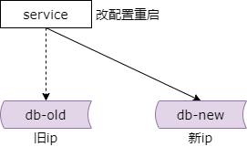
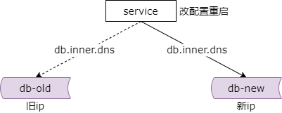
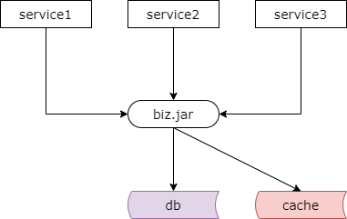
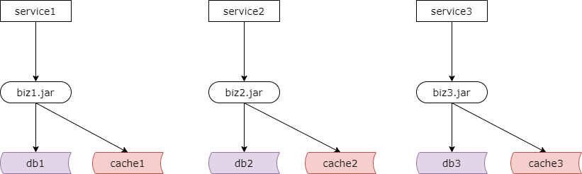
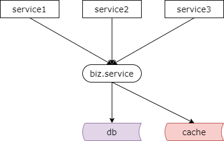

## 37、解耦：IP耦合，公共库耦合，解耦实践

### 什么是耦合？

**不该联动，因为各种原因，绑在了一起**。

**系统联动，系统耦合，是架构大敌**。

到了流量千万的阶段，耦合成了系统架构的大敌，那什么是耦合呢？系统中不应该联动却因为各种的原因绑在了一起，产生各种系统联动，这就是典型的系统耦合，是架构的大敌。

### 如何找到耦合？

**查找“被动联动”的地方**。

**每当心中怒骂“MD，明明和我无关，为何我要配合”的地方，就是耦合**。

如何来寻找系统中的耦合呢？就是需要寻找被动联动的地方。哪样的一些地方有被动联动呢？每当大家心中怒骂明明和我无关我却需要被动配合升级的地方就是系统中的耦合。

### 场景一：IP 耦合

今天会介绍两个典型的场景，场景一 ip 耦合。因为 ip 配置导致上下游必须联动就是一个耦合的典型案例。比如说线上有一台数据库服务器因为某种原因，例如磁盘故障要进行磁盘更换，运维部署了另外一台新的服务器，dba 部署好数据库实例，做好了数据，只等调用方切换了。

我们如何来进行切换呢？最常见的方法是原来数据库有一个旧的 ip，现在有了一个新的 ip，要通知所有数据库依赖的上游方切换到新的 ip 上来。怎么办呢？一一的通知上游切换呗。找到了上游，抱歉 ip 换了，麻烦修改一下配置重启，连到新的 ip 上去。

不知道大家工作中会不会遇到类似的场景，数据库或者服务的 ip 换了，你作为上游调用方需要配合重启，此时你心里可能就在骂他，明明变换 ip 的人是你，为什么修改配置重启的人是我呢。特别的，如果变换 ip 的是一个基础服务或者是一个基础数据库，调用它的上游很多，那么部门 a、部门 b、部门 c 可能需要全部找一遍，全部修改配置重启，被迫配合。

因为 ip 配置使得上下游耦合在一起的案例，其耦合范围是非常广的，最理想的情况是谁修改 ip 只需要一处修改流量就能默默的迁移过去，这就是解耦。

### 如何消除“IP 耦合”？

如何来进行 ip 解耦呢？最常见的方法是使用内网域名代替内网 ip。如果没有做这个优化，强烈建议大家马上实施，将配置文件中的内网 ip 全部干掉，全部更换为内网域名。

使用了内网域名之后就不需要上游配合重启了吗？假设现在不用内网 ip 了，改用内网域名了，一个服务或者数据库的 ip 发生变更只需要修改一处地方，就是运维修改内网 dns，将内网域名由旧的 ip 指向新的 ip。如果是短连接调用，未来新的流量将自动的切到新的 ip 上。如果是长连接调用，运维将统一将旧 ip 的连接切断，如果没有意外的话服务或者数据库的连接池都有自动重连的功能，后续流量会自动转移到新的 ip 上去。

如此这般，只需要运维配合就可以完成 ip 的迁移了，对于所有上游的调用方不需要修改配置重启，所以使用内网域名来替代内网 ip，虽然是一个很小的优化点，但对于系统架构的解耦来说却是非常的有效的。这是第一个典型的场景，ip 耦合。

### 场景二：公共库耦合

因为公共库导致相互受影响也是一个典型的耦合的案例。比如说你有一个看似公共的业务库 .so、.jar、.dll 或者 .php，很多业务系统可能都依赖于这个公共库，这个公共库使得业务系统都耦合在了一起。这里的公共库不是指像字符串操作这样不变的工具库，更多的是指通用业务的公共库。

耦合如何导致相互影响呢？假设业务一、业务二、业务三都依赖于某一个 biz.jar，业务一因为某个需求要升级这个公共库，上线前业务一的 qa 进行了大量的测试，确保无误之后发布了代码，发布上线之后业务一验证了没有问题，（上线完）走人。突然 bug 群里面有人反馈业务二的系统挂了，业务三的系统也挂了。这样一下突然炸开了锅，业务二的大老板说技术都做了什么呀，系统怎么挂了呀。业务二的研发工程师一脸无辜说业务一上线了，所以我们挂了。然后这个理由好像在老板那边解释不通，业务一上线前测试了吗？业务一的 qa 说测试了呀（只测试自己业务），上线前都验证了呀没有什么问题啊。业务二的 boss 就会对业务二的 rd 不满。

不知道大家在工作中会不会遇到这样的场景，因为公共库的耦合，兄弟部门上线影响的却是你，你心里可能就在骂了，这帮不靠谱的队友，但其实是因为因为公共库导致了多个使用这个业务公共库的业务方耦合在了一起。如果这个业务公共库使用的范围很广，那么耦合可能非常的严重，可能影响范围会非常非常的大。

### 如何消除公共库耦合？

**最粗暴的解法：代码拷贝一份**

不要嘲笑这个方案，谁敢说自己写代码的时候没这么干过。我们都知道这不是一个好的方案，但不可否认代码拷贝了以后，代码各自演化，一个地方升级出错只影响一方，拷贝方只要不动源代码，至少是不会受影响的。当然，代码拷贝的缺点非常非常多，系统拆分的时候不到万不得已不要使用这个方案。

**方案：垂直拆分，个性业务代码“上浮”**

比较好的方案是，垂直拆分，将公共库里业务个性化的代码拆到调用方去，不要实现在公共库里。这个时候需要升级业务代码，将个性化的代码拆分到各个业务线自己的工程里，比如说 biz1.jar、biz2.jar、biz3.jar，个性化的需求业务各自修改自己的代码，至少不会扩大影响。

那为什么大家经常把代码往一个公共库里塞呢？很多时候是业务惰性，一点一点的惰性，日积月累，终成大坑。这个垂直拆分需要修改各个业务侧的代码，本身一个架构重构的过程，需要各个业务方集中配合。

**方案：服务化，共性业务代码“下沉”**

除此之外，我们需要实施服务化，将共性业务的代码下沉。前面只完成了第一步，个性化的业务代码上浮到业务侧上游，接下来的第二步，对于通用的业务代码，下沉抽取一层服务，服务对上游提供，每次修改底层的接口需要做兼容性的测试，确保不影响旧的调用方。如果是新的业务，新增代码，建议新增接口，最终达到通过服务 rpc 的调用的方式来消除解耦。

这个时候可能有朋友会问了，底层服务接口的测试，上游业务层公共库的测试，都是测试，为何服务的测试能够控制影响范围呢？底层接口，所有人调用的接口，接口没有问题则调用方没有问题。上游公共库的测试只能保证自己的业务没有问题，而不能够保证其他的业务方没有问题。

所以最终来说个性业务代码上浮，共性业务代码服务化下沉，对于公共库的解耦是非常非常有效的。

### 总结

**如何风险系统中的耦合？**

查找“被动联动”的点。

**场景一：“IP 耦合”如何解耦？**

使用内网域名来替代内网 ip。

**场景二：“公共库耦合”如何解耦？**

粗暴方案：代码各自拷贝一份。

优化方案：

（1）垂直拆分，个性业务代码“上浮”

（2）服务化，共性业务代“下沉”