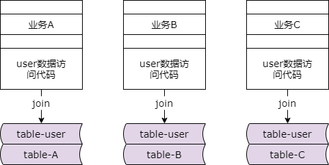
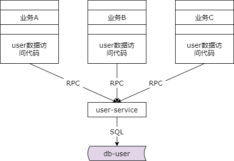

## 38、解耦：数据库耦合，解耦实战！

### 场景三：数据库耦合

今天我们来介绍第三个场景，数据库耦合。这是一个非常非常典型的，也是很多公司非常头疼的一个问题。随着业务的越来越复杂，数据量越来越大，并发量越来越大，数据库的性能将逐步的成为系统的瓶颈，运维好不容易申请了几台机器，让 dba 部署了几个（数据库）实例，想把一些业务的库拆分出来却发现拆分不出来，完全扩不了容，非常的尴尬。因为数据库强行关联在一起，无法通过增加数据库实例扩容，就是一个非常典型的耦合的案例。

### 数据库耦合，场景还原



我们来进行一下场景的还原，为什么会出现这类数据库的耦合。假设有一个公用的数据库 db user，其中 table user 表里放了很多用户的数据，比如说用户的 id，用户名，密码，等等等等。在数据量比较小，并发量比较小，业务还没有那么复杂的时候，为了提高资源的利用效率，业务 a 把用户个性化的数据也放在了这个数据库里，他创建了 table a 表，它的主键是 uid，属性是业务 a 的个性化属性。业务 a 有这样的一个需求，既要展现用户的公共属性，又要展现业务的个性化属性，于是程序员经常是这么实现的。

```sql
select * from table_user, table_A
    where table_user.uid = table_A.uid
    and table_user.uid = $uid
```

大家可以看一下上边的这个 sql 语句，大家有没有采用这种方法去取过共性的用户以及个性的用户的属性呢。在初期关联查询没有任何问题，单条记录访问命中索引，一次查询所有的数据非常的简单和高效。但是他为什么会产生业务间数据的耦合呢？这种通过连表去实现业务逻辑导致通用的用户表 table user 和个性化的业务表 table a 必须存在在一个数据库实例里面，如果业务 b 也这么做，业务 c 也这么做，就有可能导致业务 a、业务 b、业务 c 都必须存在在一个数据库实例里面，会产生什么潜在的耦合呢？比如说业务 a 上线了一个新功能，不小心进行了全表扫描，导致数据库 cpu 100%，数据库的实例性能下降。由于实例共用，通用的业务，业务 b 和业务 c 都会受到影响，即某个业务线的数据库性能急剧下降导致所有的业务都受影响。这种耦合，你会发现历史总是惊人的相似，业务 b 的大 boss 在群里面发飙，技术都干啥了，怎么系统挂了。业务 b 的 rd 一脸无辜说业务 a 上线了，所以我们都挂了。这个理由在 boss 那边好像解释不通。业务 b 的 boss 就说赶紧加几台机器，把（数据库）拆分开。业务 b 的 rd 一脸无奈，加机器，加实例也扩不了容。因为你会发现业务 a、业务 b、业务 c 全部必须在一个实例里面。

**给你服务器，也无法扩容！**

**因为拆分不开！**

加几台机器，加几个实例好像没什么用，大家都耦合在一个实例里面，完全扩不了容，完全拆分不了。

### 如何解耦？

那么如何来解除公共数据库与业务数据库的耦合，能够拆分到不同的实例里面去呢？主要分为这么几个步骤。

**第一步：公共数据访问服务化，数据私藏**



将公共数据访问下沉服务化。还是上面的例子，当公共的用户数据访问服务方之后，提取出来一个 user-service，通用的 user 数据必须通过这个 service 来访问。根据服务化的原则，上游业务层只能够通过服务的 rpc 接口去访问他后端的数据。底层的公共的 user 库属于 user 服务的私有数据，任何上游不得跨过他直接去访问底层的 user 库。这是第一个步骤。

**第二步：个性数据访问，自己家的数据自己管理**

解决完了公共属性，接下来要解决个性化属性的访问与管理。公共的数据服务化之后，个性化自己业务的数据需要自己管理，当然你可以自己通过 dao 直接访问数据库来管理自己的数据，也可以通过服务化将自己的个性化数据也建立一个 user-a service 来对自己的数据管理屏蔽底层缓存、分库分表、读写分离等等业务的复杂性。

它的本质是一个垂直拆分，自己的个性化数据自己管理，公共的数据服务化，私有化的数据垂直拆分之后，原来取公共数据和个性化数据关联访问的一次访问，现在变成了两次访问，一次取得公共的数据，通过调用公共服务的 rpc 接口，一次取得业务个性化数据，怎么取取决于你业务个性化是直接调用数据库还是自己做业务的服务 rpc 接口调用。

所以总的来说是两个步骤，公共的部分下沉拆分成服务，个性化的部分自己管理，可以直接访问自家的数据库，也可以自己做服务化，本质是垂直拆分。

### 方案对比

解耦之前：

（1）代码简单，一次数据库访问

（2）逻辑实现在 SQL 里

（3）数据库耦合

解耦之后：

（1）代码更复杂，多次数据库访问

（2）逻辑实现在服务层

（3）数据库解耦

解耦之前和解耦之后进行一个简单的对比。在解耦之前，业务代码可能会更简单一点，因为它是将这个业务逻辑放在了 sql 语句里，但导致了数据库耦合在一起。而后面这种方式，业务的代码会变得更复杂，会变成多次访问，将原来 sql 中的逻辑计算变成了业务代码中的逻辑计算，但数据库解耦了。业务越复杂，数据量越大，并发量越大，对扩展性的要求更高，所以（长远来说）架构上来说一定是后者更优。此时各个业务都有了自己的库，没有了公共的实例。在早期可以将这些数据库放在一个实例里，到了后期很容易的通过新增数据库实例的个数把 user 通用的库，业务 a、业务 b、业务 c 的库拆分到不同的实例里面去，是不是很帅气。

**达到的效果：给机器就能扩容！**

最终达到的效果是，给机器，给实例，就能够扩容。

### 总结

**场景三：“数据库耦合”任何解耦？**

第一步：公共数据访问服务化，数据私藏

第二步：个性数据访问，自己家的数据自己管理