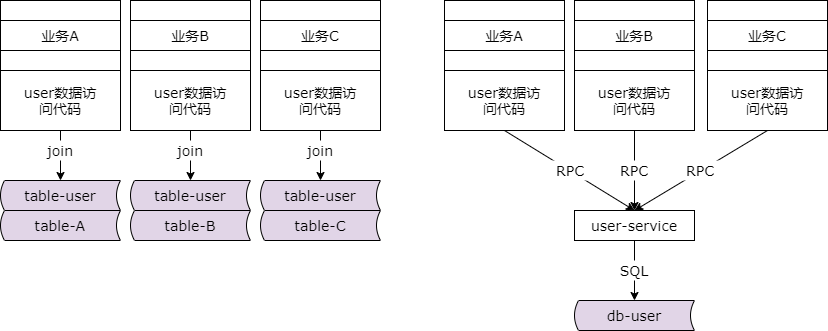
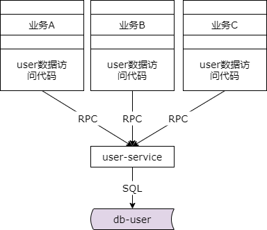
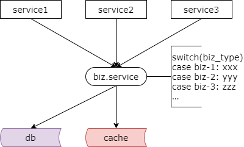

## 39、解耦：微服务耦合，解耦实战！

### 场景四：微服务耦合

除了数据库耦合，服务化之后微服务的耦合也是互联网公司非常非常常见的系统架构，如果服务化不合理，将个性化的业务下沉到了底层的微服务，耦合和瓶颈会更加的严重。

### 微服务耦合，场景还原



为什么那么说呢？上一节中提到过一个业务场景，各个业务因为公共数据的访问和个性化业务数据的访问导致了业务 a、业务 b、业务 c 耦合在了一起。要解决这个问题，上一章介绍过我们需要实现公共数据访问的微服务下沉，微服务下沉达到的是公共数据访问的数据私有化，数据的隔离。实施了服务化之后各个业务方通过这个 rpc 接口，通过这个公共数据访问的服务去访问底层的数据，屏蔽底层数据访问的复杂性。如果你抽象不合理导致了很多业务的代码实现在了这个公共的通用的服务里，耦合将更加的严重。

### 但是，服务化不合理



```php
switch(biz_type) {
    case(1): exec_logic1();
    case(2): exec_logic2();
    case(3): exec_logic3();
    default: exec_default();
}
```

怎么说呢？如果你有个性化的代码下沉到了通用的服务里，那么在底层的服务可能就会出现这样的代码，switch case 不同的 biz type 去执行不同的个性化分支，理论上这些分支应该上浮到业务层，但是很多时候你在下沉通用服务不合理的时候就可能出现根据上游传入的不同的业务线类型去执行个性化的分支，很多人以为这也是一种服务化。

为什么这种不彻底的服务化会带来极大的耦合呢？假设业务 a 来了一个新的个性化的需求，这个需求本来实现在业务 a 自己的代码里是最合理的，但是工程师想到，底层的通用服务里面也有一段个性化的代码，如果我传入业务 a 的类型，他会帮我执行这个业务 a 的处理逻辑。评估了之后，业务 a 的工程师发现在底层需求改动的代码最小，时间最短，于是就来找底层通用服务的负责人，业务的工程师说有一个小需求帮个忙呗，底层的工程师说个性化的需求实现在底层非常的不合理，业务的工程师说反正你都有 switch case 的代码了再改一点点可能也不麻烦，在我这边实现特别的复杂，工程师 b 似乎非常体谅的说，哎确实在你那边实现非常的复杂，那就由我来搞吧。于是底层通用的（服务）这个维护的工程师在这个 switch case biz a 里面又加了一些业务处理逻辑，遗留了不合理的代码，有第一次妥协就有未来的妥协，未来业务二，业务三，个性化的需求都会往底层的通用服务里面堆，这个时候底层的通用服务越来越复杂了，业务一、业务二、业务三的个性化代码越来越多，业务一、业务二、业务三的需求也越来越多的提给了底层的工程师，底层服务，底层的工程师慢慢的成为了项目的瓶颈，业务一、业务二、业务三的项目逐步的 delay（延期），而且这个锅都甩到了底层工程师的头上，直到有一天底层服务出了一个小 bug，影响了业务一、业务二、业务三，历史总是惊人的相似，业务一的大 boss 在群里面发飙，技术都干啥了，怎么系统挂了，业务一的工程师一脸无辜说底层的系统改造，是底层工程师的 bug，然而这个理由好像在大 boss 那解释不通，而底层工程师一脸委屈，需求明明是业务方的为什么每次修改代码都是我底层呢，业务代码出了问题为什么责怪的总是我底层呢，每当心中有这种不合理的被动配合修改的情况出现，系统中往往就意味着可能存在深度的耦合。

### 如何解耦？

**个性化代码上浮，通用代码下沉，服务化更彻底！**

如何来实施解耦呢？你会发现公共库的解耦，数据库的解耦，包括微服务的解耦，整个架构解耦的方法论都是非常非常相似的，就是我们要将个性化的代码上浮，通用的代码下沉，使得服务化更加的合理。服务化是将通用的访问抽取成服务，个性化的访问不宜放在底层的服务里，而放在业务个性化的代码中是更加合理的。

**个性化的代码上浮，通用代码下沉**



我们一将业务服务里 switch case 根据传入不同的业务线代码执行不同业务处理分支的逻辑理论上要放到业务上去，业务层如果发现这个对于你本业务是通用的也可以抽象你业务的服务，所以这个时候就有了底层的通用数据访问访问和业务的个性化服务。本质还是业务代码上浮，通用代码下沉，通用代码里面消除 switch case。

看上去解决方案并不复杂，但是他往往需要进行架构的重构，通用服务，业务的代码都需要修改升级。在服务化分层架构中，每一层都有自己的职责，每一层都应该守住自己的底线。如果将个性化的代码下沉，个性化代码的服务将成为系统的逻辑，所以的业务方的需求都会往下提，这边的研发工程师是根本就开发不过来的。

### 总结与启示

（1）讨论技术方案时，不要总以：

**“放在你那边做代码少”**

**“放在你那边做时间短”**

作为设计折衷的理由，而要多问：

**“怎么做合理”**

（2）尽量杜绝底层出现

```php
switch case(biz_type)
```

走不同分支的代码。

（3）**个性化代码上浮，公共代码下沉**，是亘古不变的架构设计准则