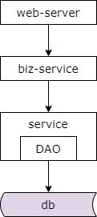
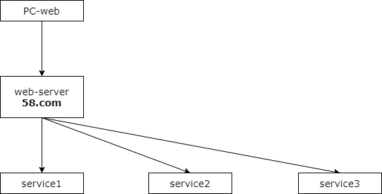
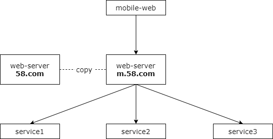
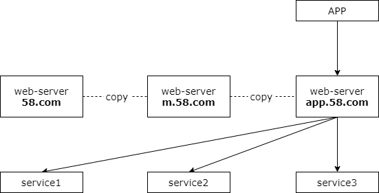
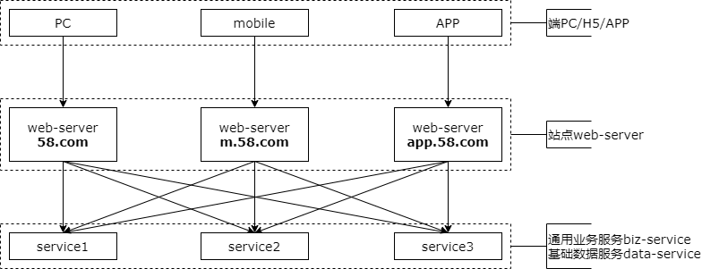
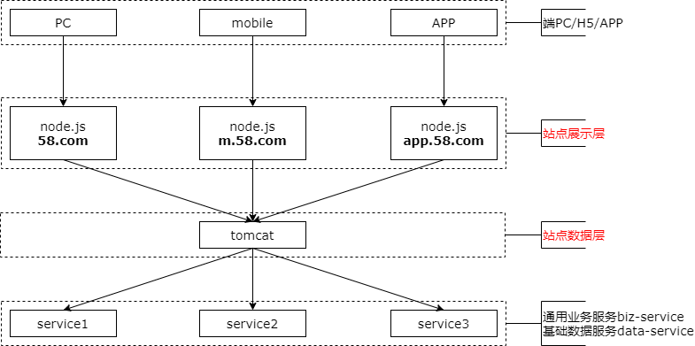
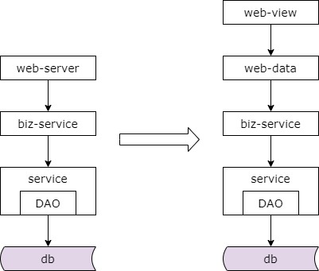

## 43、分层：前后端分离

### 业务服务化后的架构

业务服务化后系统的典型架构如上，站点应用层通过 rpc 接口从通用业务服务获取数据，通用业务服务通过 rpc 接口从基础数据服务获取数据，基础数据服务通过 dao 层从独立的数据库与缓存获取数据，最底层是数据库与缓存等存储层。

**有什么痛点呢？**

**（1）设备兼容性，折磨着 MVC 的工程师**

**（2）PC、H5、APP，前端展现变化的频率，远大于后端业务逻辑变化的频率**

随着时间的推移，系统架构并不是一成不变的，业务会越来越复杂，改版会越来越多，此时站点应用层虽然使用了 mvc 架构，但有很多痛点，大家看一看是否似曾相识。产品经理为了追求绚丽的效果对设备的兼容性要求非常的高，这样一些需求不断的折磨着使用 mvc 的工程师，不管是 pc 版，还是手机 h5 版，还是 app 版本，应用前端展现的变化频率远远大于后端逻辑的变化频率，而修改 velocity 模板并不是 java（不要争论，仅仅举例）工程师所喜欢和擅长的工作。此时随着人员的增加经常会独立出前端 fe 部门来负责交互与展现的研发，其职责与后端 java 工程师分离开，但其实痛点依然没有得到解决，一点点展现的变动需要 java 工程师重新编译、打包、上线、重启 tomcat，效率非常非常的低。原先 java 工程师所负责的 mvc 的研发，现在分为 java 和 fe 两块，需要等前端和后端都完成研发一起联调整体效果才能够上线。这不仅增加了沟通的成本，任何一块出现问题都有可能导致项目的延期。

来看一个更具体的例子。

### 早期，产品只有 PC 版本

五八同城的产品最开始只有 pc 版本，此时的系统分层架构如上，上面是端 pc 版，中间是站点应用层，站点应用层的下层是各个服务层。

### 然后，有了 H5 版本

随着业务的发展，产品需要增加 mobile 版本。mobile 版本和 pc 版本绝大部分的业务逻辑都一样，唯一的区别是屏幕比较小，所以信息展现的条数会比较少，调用微服务的时候传入的每一页的信息条数的参数会不一样，而且因为屏幕比较小，产品的功能也会比较少，但绝大部分调用的 service 都一样，少数的 service 不需要调用，当然展现层与交互层会与 pc 版有所区别。由于工期比较紧，mobile 版本的 web-server 站点应用层一般是怎么来的呢？没错，就是把 pc 版本的工程拷贝一份，然后做少量的修改，service 的调用参数有些变化，大部分的 service 调用都一样，少数 service 的调用去掉，展现与交互相关的代码进行重新的调整，这样在非常短的时间就研发出了 mobile 版本的站点应用层。

### 接着，有了 APP 版本

事情还没有结束，随着业务的继续发展，产品又需要增加 app 版本，app 版本与移动 h5 版本业务逻辑完全相同，唯一的区别是移动端 h5 版本返回的是 html 的数据格式，而 app 版本返回的是 json 的数据格式，然后进行本地的渲染。由于工期比较紧，app 版本的站点应用一般怎么来呢？没错，就是把移动 h5 版本的工程拷贝一份，然后做少量的修改，修改哪里呢？把拼装 html 的数据的部分修改为拼装为 json 数据，然后再返回 app。

最终，架构成了什么样子？

### 系统综合架构

经过迭代演化发展，架构会变成这个样子。端上是 pc 版本，移动版 h5 以及 app。站点应用层分别是 pc 版站点应用接入，移动 h5 版站点应用接入，app 版站点应用接入，然后他们分别调用底层的通用业务服务以及基础数据服务。这个架构图上的依赖关系是不是看上去特别的别扭，端到站点应用层的依赖关系非常的清晰，而站点应用层与服务层的关系变成了蜘蛛网。历史总是惊人的相似。

这样的架构还会存在什么问题呢？比如说 pc 版本，移动 h5 版，app 版本的站点应用层大部分的业务逻辑相同，只有少数的逻辑和展现交互不一样，而一旦一个底层微服务的 rpc 接口有稍许变化，所以版本的站点应用层的系统都需要升级。而且站点应用层之间出现了大量的拷贝，一旦代码拷贝出现一个 bug，多个子系统都需要升级。

### 提高“获取与处理数据”效率

然后让数据的获取更加高效快捷，如何让数据生产与数据展现的解耦分离呢？此时，前后端分离的分层抽象架构势在必行。通过前后端分离分层抽象，站点层分成了展示层与数据层。展示层使用 node.js 发展数据的展现与交互，由前端 fe 同学维护。后端站点数据层负责业务逻辑处理与 json 数据接口的提供，由 java 工程师维护。这样的好处是复杂度业务逻辑与数据的生成只有在站点数据层一处来实施了，并没有代码拷贝，当底层 service 接口发生变化的时候，只有站点数据层一处需要升级修改，如果站点数据层或者是底层的服务层出现 bug，只有站点数据层一处修改修改升级，站点展现层可以根据不同的产品形态 pc 版本、移动 h5 版或者是 app 版本传入不同的参数，调用不同的站点数据层的接口来适配端上所需要的产品形态变化。除此之外，产品追求的绚丽的效果，对设备的兼容性要求很高不再需要 java 工程师介入，由更专业的前端 fe 同学对接即可，一点点展现的变化也不再需要 java 工程师重新编译、打包、上线、重启 tomcat，约定好了 json 接口之后，java 工程师与 fe 工程师分别开发，前端 fe 工程师可以 mock 接口自测而不需要再等待后端的工程师一起联调。

### 于是，架构又演进了

于是我们的架构又演进了，这里的结论是，当业务越来越复杂，端上的产品越来越多，展现层的变化越来越多，站点层可能存在大量的代码拷贝，获取数据复杂性成为了通用痛点的时候就应该进行前后端分离这个分层抽象，简化数据的获取过程，提高数据的获取效率，向上游屏蔽底层数据获取的复杂性。最后再强调两点，是否需要进行前后端分离和业务的复杂性以及业务的发展阶段有关，千万不可一概而论。本篇强调的是前后端分离的思路，而实际情况下有多种实现方式，并没有太多的展开其实现方式的细节。总之，任何脱离业务的架构设计都是耍流氓。

### 总结

（1）分层架构，是一个“数据移动”，然后“被处理”，被“呈现”的过程！

（2）架构分层方法论：

* 让上游更高效的获取与处理数据，复用
* 让下游能屏蔽数据的获取细节，封装

（3）为了屏蔽端上多变，PC/H5/APP 等产品复杂性，需要**引入前后端分离**
