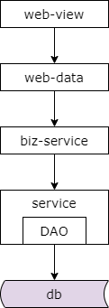
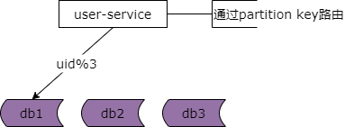
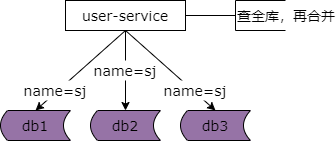
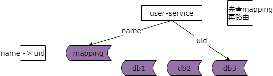
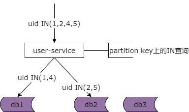
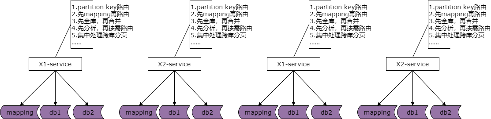
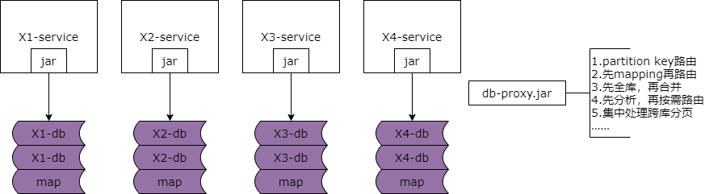
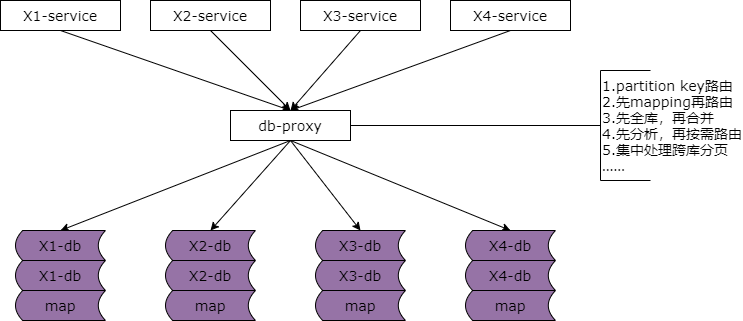

## 44、分层：数据库中间件

不少朋友经常会问我以下问题，快狗打车有没有使用数据库中间件？使用了什么数据库中间件？究竟是自研还是第三方？是基于客户端的中间件还是基于服务端的中间件？使用了中间件之后分布式事务是怎么解决的？作为架构师之路的观众大家是不是也有类似的疑问？然而为什么要引入数据库中间件？数据库中间件到底解决什么问题？这一类前置问题却很少有人问我。做架构应该解决“为什么”为优先，今天讲一讲这个核心的问题。到底为什么要引入数据库中间件？

### 前后端分离后的架构

前后端分离之后架构是这样一个样子，有 dao 层，基础数据访问层，通用业务服务层，站点数据层与站点展现层。站点展现层通过 http 接口从站点数据层获取 json 数据实施前后端分离，站点数据层通过 rpc 接口从业务服务层获取数据，业务服务层通过通用的 rpc 接口从基础服务层获取数据，基础服务层通过 dao 从数据库与缓存获取最终的数据。

随着时间的推移数据量会越来越大，基础数据服务通过 dao 来访问数据库的性能会越来越低，此时数据库需要考虑水平切分，一旦数据库进行水平切分，原来很多 sql 可以支持的功能就需要基础数据服务来进行特殊的处理。此时我们有一些什么样的痛点呢？

**（1）有些数据需要路由到特定的水平切分库**

**（2）有些数据不确定落在哪一个水平切分库，就需要访问所有库**

**（3）有些数据需要访问全局的库，拿到数据的全局视野，到 service 层进行额外处理**

**（4）···**

更具体的，对于前台高并发的业务数据库水平切分之后有这么几类典型的业务场景及应对方案。特别强调一下后边的几处案例是前台高并发数据库水平切分的场景，对于后台的需求是通过前台与后台分离的架构来进行处理的，不在此处讨论范围之内。

### 场景一：partition key 上的单行查询

典型场景一，通过 partition key 上的单行查询。这里的例子是，通过用户的 id 来查询用户的实体。这类场景的特点是，首先它通过 partition key uid 来进行查询。第二，它每次只返回一行记录。

常见的解决方案是，基础数据服务层通过 partition key 来进行请求的路由。如图所示，用户的基础服务访问底层的用户的数据库，假设有三个库，通过 uid 模 3 来路由库，直接定位到相关的库。

### 场景二：非 partition key 上的单行查询

第二个典型的场景，非 partition key 上的单行查询，典型的场景是通过用户名来进行登录，查询用户的实体。这类场景的特点是，他会通过非 partition key，假设用户的 partition key 是用户 id，但此时查询的属性是用户名，是非 partition key。第二个特点是每次也只返回一行记录，通过用户名来查询用户的行，他每次只返回一行记录。

#### （1）访问全库

常见的解决方案是用户基础服务会访问所有的库，通过用户名来查全库，结果集在用户的基础服务合并，最终只有一条记录返回。所以他需要访问全库。

#### （2）mapping 表

对于场景二还有一种常见的解决方案，通过 mapping 表记录用户名与用户 id 的映射关系，每次基础数据服务先查询 mapping 表，通过 mapping 表由用户名查询到 partition key，再通过 partition key 直接路由到相关的库。这样的话就不用每次都查询全库了。这也是很常见的一种解决方案。

### 场景三：partition key 上的批量查询

**（1）遍历库**

**（2）按需 N**

典型的场景是 uid 上的 in 查询，这类查询场景的特点是，每次需要通过 partition key 来进行查询，每次返回多行记录。有两种常见的解决方案。

第一种是像用户名的查询一样遍历所有的库，比如说你要查询的 uid 是 in 1、2、4、5，你把 in 1、2、4、5 遍历所有的库，然后在用户基础服务对结果集进行汇总。

第二种解决方案是按需的来实施 in 查询。比如说你 in 1、2、4、5 你会发现其中有两行数据 1 和 4 在第一个库，有两条记录 2 和 5 在第二个库，而第三个库并没有 key 路由上去，所以你的基础服务层只需要将相关的查询路由第一个库和第二个库，并不需要路由第三个库。

### 场景四：非 partition key 上的跨库分页需求

### 场景五：···

虽然每一种场景在基础数据服务层或多或少都有一些比较 trick 的方案，但是你发现了问题所在吗？

**（1）基础数据服务层的复杂度提高了**

**（2）获取数据与处理数据的效率降低了**

最终，我们的架构可能变成什么样子了呢？

### 系统综合架构

当数据库进行水平切分之后，基础数据服务层越来越多之后，底层的复杂性会扩散到所有的基础数据服务层，每一个基础数据服务层都需要实施按 partition key 路由，先 mapping 再路由，先全库再合并，先分析 sql 语句再按需路由，集中处理跨库分页的需求，这一些复杂性会扩散到所有的基础服务。

如此获取数据与处理数据方便还是不方便？高效还是不高效呢？如何让数据的获取更加高效快捷呢？数据库中间件的引入势在必行。

### 提高“获取与处理数据”效率

为了提高基础数据服务层获取数据与处理数据的效率我们需要引入数据库中间件。数据库中间件的实施又有两种方案，一种是基于客户端的方案。

这个架构图是基于客户端实施的数据库中间件，你把刚刚所有的按 partition key 路由、先 mapping 再路由、先全库再合并、先分析再按需路由、集中处理跨库分页等需求实施在一个中间件的 jar 包里。为什么说它是一个基于客户端的数据库中间件，因为他的这些策略是实现在客户端的。所有的数据库调用方通过这个客户端去数据库层获取数据库底层的数据，而所有底层的复杂性都封装在了这一个客户端里。这是基于客户端的数据库中间件。

还有一种是基于服务端的数据库中间件。基于服务端的数据库中间件对上游而言他就是数据库，所以上游不需要有大的修改，而所有的 partition key 路由，先 mapping 再路由，先全库再合并，先分析再按需路由，集中处理跨库分页等复杂性都屏蔽在了基于服务端的数据库中间件里。由数据库中间件去处理 mapping、路由、合并、按需等等复杂性。这样的话就极大的提高了基础数据服务层获取与处理数据的效率。这也是引入数据库中间件的原因。

### 于是，架构又演进了

于是，我们的架构又演进了。这里的结论是，当基础数据服务层通过 dao 去数据库获取与处理数据成为通用痛点的时候我们就应该抽象出一层数据库中间件简化数据的获取过程，提高数据的获取效率，向上游底层的数据复杂性。

最后要强调的一点是数据库中间件的技术门槛还是相对比较高的，如果只有一到两个基础数据服务层有水平切分的需求，那么还是建议在基础数据服务层处理，但如果有非常非常多的基础数据服务层都需要面临与解决这个问题，那么抽象出不管是基于客户端的数据库中间件还是服务端的数据库中间件就是非常有必要的了。任何脱离业务的架构设计都是耍流氓。

### 总结

（1）分层架构，是一个“数据移动”，然后“被处理”，被“呈现”的过程！

（2）架构分层方法论：

* 让上游更高效的获取与处理数据，复用
* 让下游能屏蔽数据的获取细节，封装

（3）为了屏蔽数据库层面的复杂性，需要**数据库中间件**
