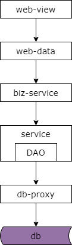
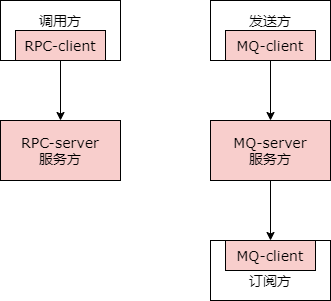
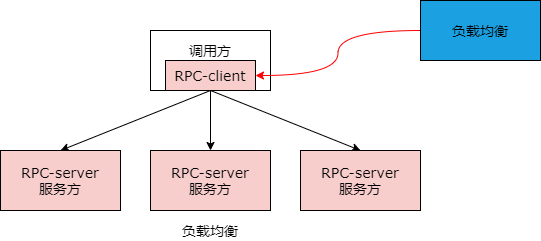
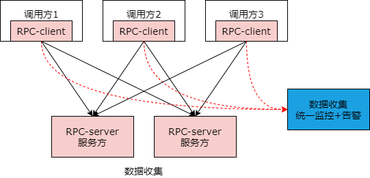
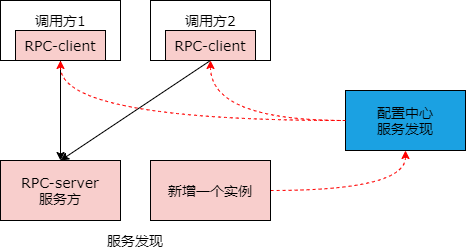
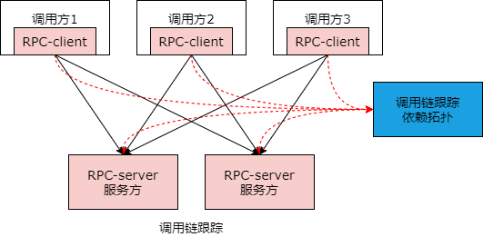

## 45、进阶：服务网格（上）

### 回顾

（1）分层架构，是一个“数据移动”，然后“被处理”，被“呈现”的过程！

（2）架构分层方法论：

* 让上游更高效的获取与处理数据，复用
* 让下游能屏蔽数据的获取细节，封装

首先我们来对之前的章节进行一个简要的总结。前面的四五章里主要是讲分层架构。分层架构是一个数据移动，然后被处理与被呈现的过程。我们实施架构分层的方法论是，要让上游更高效的获取与处理数据，要让下游获取数据的细节被屏蔽掉。

通过前面五六章的介绍我们知道当数据库的数据获取成为通用痛点的时候需要抽象出 dao 层与数据库中间件。当缓存、数据库读写分离、主从同步等数据获取的细节成为通用痛点的时候需要抽象出业务服务层与基础数据服务层。当前端业务多变，需要屏蔽 pc、h5、app 等端上多变需求的时候需要抽象出站点展现层与站点数据层。那么在此之后微服务的分层架构将走向何方呢？

最近几年，service mesh 特别的火爆，服务网格化大行其道，那么服务网格他到底解决什么问题，他是否也遵循互联网微服务分层架构演进的方法论呢？我们今天一起来讨论一下。

我们先来看一下微服务的分层架构是否存在什么问题？

### 微服务分层架构

互联网公司最常使用的是微服务分层架构，随着数据量不断的变大，吞吐量不断的增加，业务越来越复杂，服务的个数会越来越多，分层也会越来越细，不断发现主要矛盾，抽离主要矛盾，解决主要矛盾，架构自然不断的演进。微服务架构潜在的主要矛盾是什么呢？引入微服务架构一般会引入一个 rpc 框架来完成整个 rpc 的调用过程。如上图的粉色部分所示，rpc 它分为 rpc client 层，它嵌在调用方的进程里，以及 rpc 的 server，它是服务进程的基础。不只是微服务，mq 也有类似的架构。如上图粉色部分所示，mq 分为 mq 发送方的 client，mq server 以及 mq 接收方的 client。框架只是第一步，越来越多的和 rpc 以及微服务相关的功能会被加入到框架里来。

#### 负载均衡

举个例子，比如说负载均衡。如果需要扩展多个负载均衡方案，比如说轮询，比如说随机，比如说按 id 取模，比如说一致性哈希，这样的话就需要对 rpc 的 client 进行升级以求支持不同的负载均衡方案。

#### 数据收集

除了负载均衡，数据的收集如果需要对 rpc 接口的处理时间进行数据的收集来实施统一的监控与告警也需要对 rpc client 进行升级。rpc client 客户端视角的处理时间的数据上报，rpc server 服务端请求处理时间服务端视角的上报，都需要统一的进行数据的收集上报，分级告警。

#### 服务发现

不止于此，如果我们需要实现通用的服务发现，比如说服务方新增一个实例我们要通知配置中心，配置中心需要将已注册的 rpc client 进行反向的通知，rpc client 会将流量打到新增的实例上去，此时也需要对 rpc 的 client 进行升级来平滑的完成扩容。

#### 调用链跟踪

不止于此，如果要做全链路的调用链跟踪，rpc clent 也需要上报一些数据，rpc server 也需要上报一些数据，你会发现在整个的过程中 rpc 的框架，不管是客户端还是服务端都需要进行多次的升级。

负载均衡，数据收集，服务发现，调用链跟踪这些非业务的功能，一般是如何实现的呢？互联网公司一般会有一个类似于架构部的技术部门去研发与升级相关的功能，而业务线的研发部门直接使用架构部研发出的框架工具平台来享受各种黑科技带来的便利，是不是十分的完美。理想非常的丰满，而现实却非常的骨感，在这个过程中我们可能存在什么样的问题呢？

### 潜在的问题

（1）业务技术团队，学习成本

（2）架构团队，维护成本

（3）多语言客户端支持，开发成本

（4）推广周期，时间成本

由于 rpc client 它是嵌在调用方的进程里，rpc server 它是在服务端的进程里，所以往往会面临以下的一些问题。业务技术团队需要花时间去学习与使用基础框架与各类工具而不是全心全意的将精力花在业务与产品的研发上。架构团队 rpc client 需要维护 m 给版本，rpc server 需要维护 n 个版本，兼容性测试往往需要测试 m*n 个版本。如果业务研发团队使用了不同的研发语言，架构部往往要支持不同语言的客户端，需要开发 c client、python client、go client、java client 等多语言的版本。最要命的是每一次黑科技的升级往往都需要推动上下游进行升级，这个周期往往是以季度、半年、甚至更久，整体的推广效率极其的低下。大家可以看一下自己的公司推广一个新技术周期需要有多长。

这些耦合，这些通用痛点，如何解决？

### 分层解耦，提高效率，是亘古不变的解耦原则

一个思路是将服务拆分成两个进程来进行解耦。分层解耦提高数据的获取效率与处理效率是亘古不变的架构分层解耦的原则。一个进程实现业务逻辑，不管是调用方还是服务的提供方，见图中的白色方块（biz）。一个进程实施底层的技术体系，proxy 即上图的蓝色方块，所有的负载均衡、监控报警、服务发现、服务治理、调用链跟踪等等诸多基础设施跟技术体系建设相关的都实现在蓝色的这一层。而业务处理层与 proxy 层是共同诞生、共同消亡、互为本地部署的，如上图的虚线框，有一个调用方或者是服务方才有一个 proxy，biz 和 proxy 之间是本地的通信，即（黑色）实线的箭头，而所有业务跨进程的业务方调用都是通过 proxy 来实施远程调用的，即上图中的红色箭头。这里面有几个关键的点，业务实现方与技术体系实现方是共生的，共同消亡，共同诞生，业务服务方与技术体系的实现方它是本地通信，所谓的本地通信是在同一台机器上部署的两个进程之间的通信，而所有的跨节点的调用都是通过基础服务的这个进程去调用的，比如说你的调用方一需要调用服务方 x，它是先通过本地 proxy 调用远程的 proxy 再调用服务方 x，服务方 x 的请求回复是本地 proxy -> 远端 proxy -> 调用方，是这么来做的。

### 服务网格，SM（Service Mesh）

如此一来，这样就实现了业务的归业务，技术的归技术，实现了充分的解耦，如果所有的结点都解耦，整个架构就会变成这个样子。

所有的绿色是业务的实现，不管是业务的调用方还是业务的服务提供方。所有的蓝色是基础设施的实现。所有的远端的调用都是通过蓝色的节点来实施的。整个服务集群变成了网格状。这就是 service mesh 服务的由来。如此一来我们在实施服务发现、监控告警、数据上报的时候，只需要重启和升级 service mesh 底层的技术体系进程，而所有的业务进程是不需要动的。通过这种方法来实现一个业务与技术的解耦。

### 总结

（1）分层架构，是一个“数据移动”，然后“被处理”，被“呈现”的过程！

（2）架构分层方法论：

* 让上游更高效的获取与处理数据，复用
* 让下游能屏蔽数据的获取细节，封装

（3）业务的归业务，技术的归技术，服务网格（service mesh），本质也是分层解耦

架构演进永无穷尽，痛点多了自然要分层解耦。