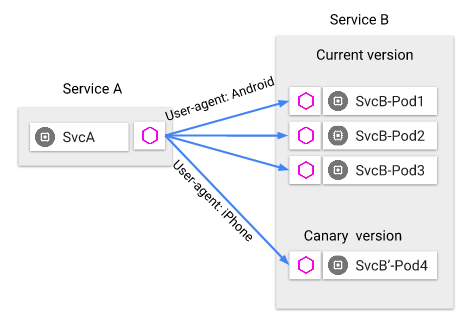

## 46、进阶：服务网格（下）

### 业务代码，技术实施技术解耦

当微服务架构体系越来越复杂的时候需要将业务服务与基础设施解耦，将一个微服务的进程一分为二。一个进程实现业务逻辑，biz，即上图中的白色方块。一个进程实现底层的技术体系，proxy，即上图中的蓝色方块，负载均衡，监控告警，服务发现，服务治理，调用链跟踪等等诸多基础设施都实现在这一层。biz 层与 proxy 层是共生的一个状态，他们之间是同一台机器上两个进程的通信，而服务的调用方与服务的提供方之间会通过 proxy 进行远端的调用，也就是说所有的远端访问都是通过 proxy 之间来进行的。

### Istio，ServiceMesh 的行业开源实践

关于服务网格行业的最佳实践是什么呢？要聊 service mesh 就不得不提 istio，他是 service mesh 目前最流行的实践。istio 它是 service mesh 的产品化落地。接下来简单的说一下 istio 的能力与架构，看大家能不能对实现自己的 service mesh 有一些启示的作用。

### Istio 是什么？关键词如下：

（1）帮助微服务**建立连接**，帮助技术团队更好的**管理与监控**微服务

（2）专注于提供基础架构能力，包含但不限于：服务发现（discovery），负载均衡（load balancing），故障恢复（failure recovery），服务度量（metrics），服务监控（monitoring），灰度发布（canary rollouts），限流限速（rate limiting），访问控制（access control），身份认证（end-to-end authentication）

（3）使得业务工程团队，与基础架构团队更高效配合，各自专注于自己的工作，更好的**赋能与解耦**

之前说服务网格的时候，它的分层解耦的逻辑大致也是这个样子的。

### Istio 的特性

（1）流控（traffic management）

（2）安全（security）

（3）可观察（observability）

（4）平台无关性（platform support）

（5）集成与定制（integration and customiation）

istio 的核心特性是什么呢？在官网上他强调了自己提供的五项关键特性。

第一项是流控。他通过断路器来实现超时，重试，高可用，多路由规则，ab 测试，灰度发布与按百分比分配流量等等特性。

第二他强调是安全。所有的加密，身份认证，服务到服务的权限控制，k8s 里容器到容器的权限控制，都由 istio 来统一实施。

同时，istio 强调了他是可观察的。所有的流量，请求的追踪，监控数据收集，通过控制后台能够全面的了解上行下行的流量，服务链路的流量，服务运行的状况，并统一的实施系统性能的监控。国内的微服务架构体系其实在可观察这一块做的是比较差的。

同时，istio 强调了自己的平台无关性。所有的物理机，k8s，虚拟机都没有问题。

并且他提供可定制化的扩展功能。

这是 istio 在他的官网强调的他的五大特性。

### Istio 分层架构

数据平面（data plane）

控制平面（control plane）

istio 他的分层架构设计是什么样的呢？它是一个典型的数据平面与控制平面两层的一个分层架构，这也是 istio 架构的核心。数据平面与控制平面其实并不是 istio 第一次提出，他是计算机网络报文路由转发里相对成熟的概念。

所谓的数据平面，其实是路由器里一般来用作快速的转发。所谓的控制平面，一般为快速转发提供必要的信息。他的设计原则是在一个路由设备里转发是最重要的工作，他具备最高的优先级。数据平面的设计核心就是高效的转发，如何在最短的时间里处理最多的包，往往使用非常高效的内存，队列，超时等技术实现在硬件里面。而控制平面则不然，他要实现路由协议，设备管理，arp 等协议，所以他更偏向于控制与应用，往往在软件层里实现。

这里面最重要的架构设计原则就是控制与实施的分离。

**其核心架构方法论：控制与实施分离**

由一个数据平面来实施转发，由一个控制平面来提供相关的配置信息与后端的管控。对于 istio 的架构与组件与路由器非常非常的相似。

服务，最上面的小红框，与 proxy 之间交互。数据平面由一系列的 proxy 组成，这两个小红框是数据平面，它的核心职责是高效的转发，接收与实施来自控制平面的策略，而控制平面，底下的大红框，它的核心作用是控制与应用，它的核心职责是管理与配置 proxy。对于整个 istio 有一系列的核心组件，proxy 它的核心职责是高效转发，更具体的他具备这样的一些通用的能力，像服务发现，负载均衡，安全传输，多协议支持，健康检查，断路器，按百分比分配流量，故障注入，系统度量等等都是由 proxy 统一实施的。大部分是 rpc 框架都所具备的一些能力，所以相对比较好理解。

控制平面有四个核心组件，第一个是 mixer，他提供跨平台（能力）以及与其他组件实施 adapter，同时他与 proxy 进行通讯，实时的收集各种数据，并下发各种策略。mixer 的设计核心在于插件化。

下一个核心组件是 pilot，他的核心能力是为 proxy 提供服务发现，以及各种智能路由的能力，比如说 ab 测试，灰度发布等等都是通过 pilot 去下发配置以及下发策略的。pilot 他的核心设计在于标准化，能够将各种流控命令通过 mixer 下发到 proxy。

最后的几个核心组件，一个是用来实现身份认证以及安全相关的组件。一个是用来实现配置获取，校验，处理，分发的组件。这些核心组件的设计关键在于解耦，他们能够将平台底层与 istio 的设计核心解耦开来。

Istio，数据平面与控制平面如何配合，实现技术基础架构的非业务功能？这里以灰度发布为例，举一个例子。

### 灰度发布

Pilot：配置策略

Envoy（proxy）：落地策略

我们如果要实施灰度发布，通过 pilot 来配置策略，通过 mixer 来下发策略，通过 proxy 来落地策略。

istio 流控模型的本质是流量控制与服务实例解耦。用户通过 pilot 设定流量期望以什么样的规则进行路由，数据平面 proxy 从 pilot 中获取规则，接受命令，然后落地不同的流量分配原则。如上图所示，最开始的时候 service a 访问旧版本的 service b，大家可以看到，灰色的圆形是 service 服务，紫色的六边形是 proxy 代理，服务与代理之间是本地两个进程的访问，服务与服务之间是通过 proxy 代理来进行远端交互的。

服务 b 要发布一个灰度版本，需要将 5% 的流量打到服务 b 的新版本，只需要首先部署服务 b 的新版本，然后再控制平面 pilot 上进行策略配置，策略通过 pilot 同步到 proxy，proxy 接收相关的策略实施分流，整个过程业务服务与流量控制完全解耦，让技术的归技术，让业务的归业务，非常的完美。

除了基于按流量比例分流的灰度发布，基于应用层的灰度发布也可以通过 istio 非常容易的实现。如上图所示，服务 b 要发布一个灰度版本，需要把 iPhone 的流量打到 b 的新版本，操作流程完全一样。首先部署服务，然后在 pilot 进行控制，pilot 将策略下发到 proxy，proxy 进行流量的实施。在这个过程中调用方的服务 service a 不需要升级，服务提供方旧的服务 b 也不需要升级。

**对于服务发现，负载均衡等 N 个基础技术架构策略实施也类似：**

**控制平面配置策略，数据平面实施策略**

### Service Mesh-Istio 总结：

（1）二层架构

（2）五大模块

* **数据平面**，主要负责高效转发

（1）envoy 模块：即 proxy；

* **控制平面**，主要负责控制与应用

（2）mixer 模块：支持跨平台，标准化 API 的 adapter；

（3）pilot 模块：控制与配置 envoy 的大部分策略；

（4）citadel 模块：安全相关；

（5）galley 模块：与底层平台（例如：k8s）配置解耦；

本章图片来源：

1. [Istio分层架构？80%的人有误解](https://blog.csdn.net/shenjian58/article/details/89849198)
2. [Istio，灰度发布从未如此轻松！！！](https://blog.csdn.net/shenjian58/article/details/90625245)