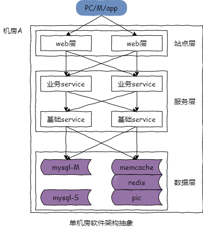

## 47、进阶：多机房多活架构（上）

前面讲的几十章，都是单机房的架构

单机房的高可用，容“节点故障”错误

多机房的高可用，容“机房故障”错误

接下来的几章我们讲讲多机房多活的架构。

对于一个单机房它的架构特点是什么呢？

### 单机房架构特点：全连接

如果要用一个词来描述单机房的架构特点，我会用“全连接”。这是一个典型的互联网单机房的系统架构图。上游是 pc 浏览器或者是 app。然后是反向代理层以及站点接入层，它做了高可用的集群。接下来是服务层，分为业务服务层和基础服务层，也都做了高可用的集群。最底层是数据层，包含缓存和数据库。单机房的架构，所有的应用，服务，数据都部署在同一个机房内，其架构特点是全连接。

什么是全连接呢？站点层调用业务服务层，业务服务层复制了多少份上层就要连接多少个服务。业务服务层调用基础服务层，基础服务层集群有多少个节点业务服务层就要连接多少个基础服务层。服务层调用数据库，数据库冗余了多少份，基础服务层基本上就要连接多少个数据库。

全连接架构如何系统的负载均衡与高可用呢？全连接架构的负载均衡与高可用保障是通过连接池去实现的。不管是反向代理层还是站点层，业务服务层，基础服务层，都有服务的连接池，或者是数据库的连接，他们实施全连接，当有其中的一个节点挂掉的时候该节点从连接池中剔除以保证高可用。

全连接的架构是否能够套用到多机房呢？答案是否定的。

如果直接将单机房的全连接架构复制到多机房，你会发现会有非常多的跨机房的连接。站点层连接业务服务层有一半的请求会跨机房，业务服务层连接基础服务层也会有一半的请求跨机房，基础服务层连接数据库和缓存也会有一半的请求跨机房。大量的请求跨机房会带来什么问题呢？同机房连接内网的性能损耗几乎可以忽略不记，一旦涉及到跨机房的访问，即使机房与机房之间有专线，访问的延时也可能增加到几毫秒甚至几十毫秒，具体延时是多少跟机房间的光纤距离有关。举一个例子，假设用户访问一个页面需要用到很多很多的数据，（获取）这些数据可能有 20 次的相互调用，站点调服务，服务调缓存，服务调数据库，业务服务调基础服务，如果有一半的请求跨机房的调用，那也就是有十次会进行跨机房的交流，假设机房之间的延时是 50 毫秒，那么因为跨机房调用导致的请求延时就高达 500 毫秒，这个是绝对不能够接受的。

那么全连接的多机房架构不可接受，什么是最理想的多机房架构呢？

### 多机房多活架构特点：同连接

理想的多机房多活架构如果要用一个词来描述，那就是“同连接”。

什么是同连接呢？如上图所示，多机房多活架构在最理想的情况下，除了异步的数据同步需要跨机房通信之外，其他所有的调用都是同机房的连接，站点连业务服务，业务服务调基础服务，基础服务调数据库和缓存，全部只调同机房的服务，另外一个机房也是全部只调同机房的服务，只有数据层异步数据同步的时候他需要跨机房的连接。每个机房是一套独立的系统，当发生机房故障时，将流量从一个机房切到另外一个机房就能冗余机房级的故障，实现机房级的高可用。

如果全部实现同连接，每个机房都只连接自己的服务，那他可能存在什么问题呢？

### 异步数据同步，延时难以接受

上述多机房架构存在的问题是异步数据同步存在较大的延时，例如说一分钟，这个延时的存在会使得两个机房的数据不一致，从而导致非常严重的业务问题。举个例子，某一个时刻用户有余额 100 元，两个机房都存储了该余额的精准数据，接下来在 a 机房用户消费了 80 元，余额得到 20 元，一分钟之后该数据会同步到 b 机房，而在数据同步到 b 机房之前，b 机房又消费了 70 元余额剩 30 元，该数据在一分钟之后会同步到 a 机房，最终数据同步之后会导致你的数据不一致，100 的余额却买了 150 的东西，并且剩下的余额会得到异常，余额究竟是 20 元还是 30 元呢？

任何脱离业务的架构都是耍流氓，上述的架构适用于什么样的业务场景呢？当每个机房都有很多全局业务数据访问的场景时这个架构并不适用，会存在大量的数据不一致，但是当每个机房都访问局部的业务数据时上述的多机房架构是可行的。典型的的业务是滴滴呀，快狗打车呀这样的业务，存在数据聚集的效应，以快狗打车为例，下单的用户都是在同一个城市，接单的司机也是在同一个城市，订单交易也是在同一个城市，所以即使城市与城市之间存在一分钟的异步数据同步的延时对业务也不会造成太大的影响，但如果所有的数据都可能存在集中访问，那么一分钟的延时就会造成很大的业务问题，这个架构就无法接受了。

多机房多活架构如果做不到理想状态的同级机房连接有没有折中方案呢？

### “最小化”跨机房连接

如果完全避免跨机房的调用理想状态做不到，就尽量的做到最小化跨机房调用。如上图所示，在非必须的情况下，优先连接同机房的站点与服务，站点层调用业务服务层连同机房，业务服务层调用基础服务层连同机房，基础服务层调用数据库的读库连同机房。这个方案没有完全避免跨机房调用，但他做到了最小化的跨机房调用，只有写请求有一个机房的写请求连数据库的主库是需要跨机房的，同时有一个机房的从库主从同步，只有这两个地方是需要跨机房的。但是互联网的业务绝大部分是读多写少的场景，例如百度的搜索其实 100% 都是读业务，京东淘宝 99% 是浏览搜索的读业务，只有下单支付是写业务，五八同城 99% 的帖子的列表，详情，首页，搜索都是读业务，只有帖子的发布 1% 的请求会跨机房的写主库。一方面来说，写，比例相对较小，所以跨机房的写主库其实只占非常非常少的流量，而主从的同步本身就有一个时延，有一个机房有跨机房的主从同步，只是在原有时延上可能增加了 20 毫秒。

该最小化跨机房连接的多机房多活架构，因为他存在一个数据库主库，所以他的机房也有主机房和从机房的差别。如果从机房挂掉，把流量全部切到主机房，即可容机房故障，如果主机房挂掉，（切流量之前）只需要将从机房的从库变为主库，相关的服务连接主库就能够容主机房错误，但这个过程中需要少量的人工介入。

之前强调过很多次，不需要使用内网 ip，一定要使用内网域名，如果使用内网域名的话，基础服务层连接从库变为的主库只需要在运维层面进行少量的修改（写库内网域名换 ip 指向）就能够恢复主机房错误的故障。所以我们一定要用内网域名而不要使用内网 ip。

最小化跨机房连接的多机房多活架构是一个实践性落地性非常强的架构，他对原有的架构体系的冲击非常的小，和单机房架构相比他仅仅是跨机房的数据同步会多几十毫秒延时，跨机房的很少量的写请求会多几十毫秒的延时，同时他能够容从机房错误，以及主机房错误少量的运维介入就能够恢复主机房错误。

### 总结

（1）单机房架构：全连接

（2）理想多机房架构：同连接（适用于能够按业务进行数据分割的场景）

（3）折衷多机房架构：最小化跨机房连接（通用）