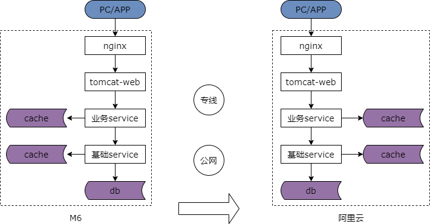
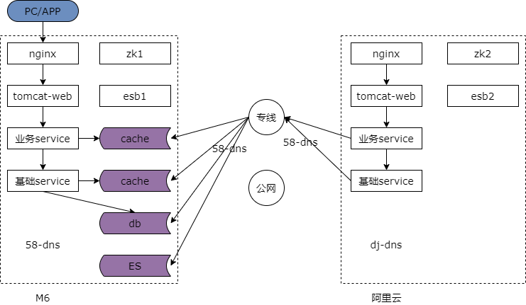
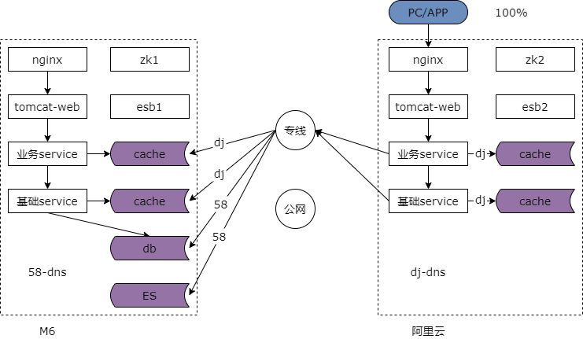
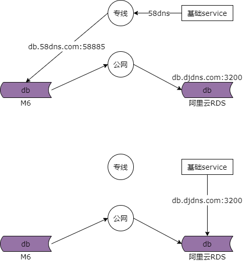

## 48、进阶：多机房多活架构（下）

新的问题是如果我们需要实施机房迁移呢？比如说，很多公司原来他的技术体系在 idc 机房里，随着云的发展整个扩展性，成本都越来越好，他想把 idc 机房里的系统全部迁到云上去，此时我们应该怎么做呢？

问题一我们进行机房迁移，迁移方案的目标是什么？

### 机房迁移目标：平滑，高可用，可分批，可回滚

单机房架构他的特点是全连接，机房迁移是要做一个什么样的事情呢？如上图所示，迁移之前系统全部部署在机房 a 内，他是一个全连接的单机房架构，迁移之后系统部署在了机房 b，可能是阿里云里，仍然是单机房架构，只是换了一个机房而已。有什么好的迁移方案吗？最容易想到的迁移方案是把所有的服务在新机房全部部署一套，然后把流量切过来，这个方案存在什么问题呢？最大的问题是得停止服务，丧失了可用性。即使可以接受停止服务，有几百台机器，几千个系统的时候，部署一套切流量一步成功的概率非常的低，风险非常的高，因为系统的依赖关系实在是太复杂了，所以机房迁移的难点是平滑的迁移，整个过程不停服务保证高可用并能够支持可分批可回滚蚂蚁搬家式的迁移，所以这是我们进行机房迁移的目标，平滑，高可用，可分批，可回滚。

那么在迁移的过程中，问题二，临时的多机房多活架构是否能够避免呢？如果想要平滑的迁移机房不停服务且逐步的迁移，迁移的过程中势必存在着一个中间的过渡阶段，两边机房都有流量，两边机房都对外提供服务，这个中间状态就是一个多机房多活的架构，所以迁移的过程中多机房多活的架构不可避免，而上一章我们聊到理想的多机房多活方案往往行不通，折衷的多机房多活方案是机房迁移过程中一个临时的中间状态架构。

第三个问题是，我们如何的实施分层的平滑迁移呢？

### 步骤一：站点与服务迁移（无状态）

第一个大的步骤，我们要对无状态的站点层与服务层进行迁移，站点层和服务层没有状态，所以迁移起来并不是那么困难。

首先，我们要对新机房和专线进行提前准备。然后我们要在新的机房搭建好待迁移的子业务的反向代理，站点应用，业务服务和基础服务，并做好充分的测试。这里需要重点说明的是，垂直拆分的迁移每次的迁移范围不要太大，划分好子业务和子系统。缓存和数据库还没有迁移，所以短时间内存在跨机房访问。新机房的配置文件注意同连，不要跨机房的调用业务服务与基础服务。在新机房测试完成之后，整个过程中只要不迁移流量依然是老机房提供服务，新机房随便玩。测试完毕之后，新机房灰度的切流量，比如说被迁移的子系统切 5% 的流量到新机房，此时这 5% 的流量会经历新机房的子业务的反向代理，站点应用，业务服务和基础服务，缓存和数据库仍然通过专线连老机房。观察新机房 5% 的站点与服务是否有异常，如果没有异常再 10%，20%，50%，100% 的逐步放量直到某一个子业务所有的反向代理，站点应用，业务服务，基础服务全部迁移至新机房。如何应对异常呢？在迁移的过程中，该子系统反向代理层，站点层，业务服务层和基础服务层，任何一块任何时间发生异常都可以将流量切会旧机房，旧机房的站点服务等配置都没有改动依然能够对外提供服务。所以这是一个蚂蚁搬家式的非常稳的迁移方案。

### 步骤二：缓存迁移（有状态，但数据可重建）

第二个大的步骤是有状态但数据可以重建的缓存的迁移。当某一个子业务子系统的反向代理，站点应用，业务服务，基础服务的流量 100% 迁移到新机房之后，接下来我们要迁移该子业务子系统的缓存。

经过了第一步迁移该子业务的所有流量都迁到了新机房，缓存和数据库仍然使用旧机房，接下来我们在新的机房搭建好缓存，缓存的规模和体量与该子业务子系统在旧机房的规模和体量完全一样。（缓存）按照子业务垂直拆分新机房，切换的步骤为，运维做一个缓存的内网 dns 切换，之前的章节多次强调过我们要使用内网域名而不是内网 ip 来连接上下游。业务服务和基础服务通过原有的的域名连旧机房的缓存，运维将该域名重新指向到新机房，因为缓存的连接是长连接，修改域名指向之后流量并不会打到新的缓存里，这个时候在运维层面杀掉原有缓存的连接，业务不需要做任何的修改，缓存连接池会自动的重连，逐步的流量会迁移到新的机房的缓存集群上来，业务的研发只需要配合观察服务的稳定性是否有异常就可以了。就这样一个子业务子系统的缓存就由旧机房迁移到新机房了。这里有几个需要注意的点，如果没有使用内网域名而是使用 ip 直连缓存，那么可能被迁移的业务服务和基础服务需要修改配置重启来进行缓存集群的切换。之前说过无数次一定要使用内网域名。还有在缓存迁移时间的选择上尽量选择在流量低峰期，新的缓存是空数据，如果选择流量高峰期，短时间内可能有大量的请求透传到数据库上导致数据库雪崩，所以要在流量低峰期慢慢的缓存预热，预热到流量高峰期，挡住大部分的流量保护数据库。对于同一个服务缓存的切换是瞬时的，不会同时的使用新旧两套缓存，否则非常容易出现数据不一致的问题。缓存的切换也是按子业务按子系统垂直拆分蚂蚁搬家式迁移的，整个迁移过程除了运维切换内网域名，研发和测试都只是配合观察服务，风险非常的低。缓存由于允许 cache miss，不用转移旧缓存内的数据到新缓存，所以迁移方案相对来说也是比较简单的。

### 步骤三：数据库迁移（有状态，数据也要迁移）

最后我们要进行有状态的数据库迁移。数据库不能像缓存一样，必须提前进行数据的迁移。

在数据库迁移之前，所有的业务服务和基础服务都是通过专线跨机房的访问旧机房的数据库。如何进行数据库的迁移呢？当然首先你得在新机房搭建新的数据库。然后要进行数据的同步，旧机房到新机房通过公网或者专线进行数据库的同步。阿里云的 dts 数据同步早年有一个坑不能使用专线同步只能使用公网同步，现在不知道 dts 升级了没有。数据库同步完成之后，如何进行数据源的切换呢？能不能像缓存一样运维修改一个数据库内网 dns 指向，切断数据库连接，然后让服务重连数据库呢？这样的话看上去业务服务是不需要改动的也不需要重启的。听上去非常的不错，但实际不能这样进行，原因有二，其一一定得保证数据库同步完成才能够切流量，但数据的同步总有一个时延，旧机房一直在不停的写数据，何时才算数据库同步完成呢，所以这个时间差你是没办法保证的。第二点只有当域名和端口不发生变化的时候才能够修改内网域名配置切换，人工域名和端口，主要是端口发生变化是做不到不修改配置重启的。举个例子，我们原来就有的数据库实例使用了 58885 或者 5858 等端口，而阿里云要求使用 3200 端口，这个情况下你就必须修改配置重启。最终的方案是 dba 在旧机房的数据库设置一个 read only，停止数据写入，在秒级别 rds 同步完数据之后，相关的业务服务与基础服务修改连接数据库的配置重启，完成数据库的切换，在这个过程中为了保证数据的一致性会损失秒级别的写入可用性，会有一个秒级别的 read only，同步完成之后再切换数据。

### 最终状态

经过上述的步骤最终我们某一个子业务某一个子系统的反向代理，站点应用，业务服务，基础服务，缓存和数据库都由一个机房迁移到了另外一个机房。因为我们的方案是能够支持垂直拆分逐步平滑蚂蚁搬家式迁移的，所以按照相同的步骤迁移第二个子系统，第三个子系统，迁移第二个子业务，第三个子业务。对于快狗打车而言我们的几百台机器几千个集群耗时一个多季度完全从旧的机房迁移到了新的机房，在迁移的过程中我们有一个临时的多机房多活的一个状态。

### 总结

**一、先迁移站点层、业务服务层和基础服务层**

（1）准备新机房与专线；

（2）搭建集群，充分测试，子业务垂直拆分迁移；

（3）灰度切流量；

**二、缓存层迁移**

（1）搭建新缓存；

（2）运维修改缓存内网 DNS，切断旧缓存连接，重连新缓存（这一步很骚），切流量；

**三、数据库迁移**

（1）搭建新数据库；

（2）同步数据；

（3）旧库 ReadOnly，同步完成后（秒级），服务指向新库，改配置重启，切流量；