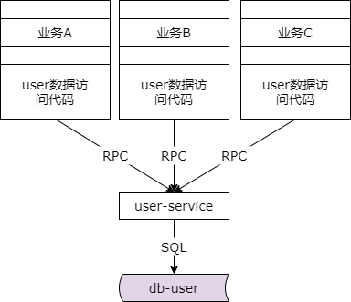

## 49、本章总结：解耦与分层，永无止境

### 什么是耦合？

**不该联动，因为各种原因，绑在了一起。**

**系统联动，系统耦合，是架构大敌。**

什么是耦合呢？如本章所述，不该联动，却因为各种原因绑在了一起，系统联动，系统耦合，是系统架构的大敌。

### 如何找到解耦？

**查找“被动联动”的地方。**

**每当心中怒骂“MD，明明和我无关，为何我要配合”的地方，就是耦合。**

如何找到系统中的耦合呢？我们要查找被动联动的地方，每次当你心中怒骂明明和我无关为何我却要配合修改的地方往往就是耦合之处。

### 配置中心，解耦利器：逻辑上解耦，物理上连接

配置中心是互联网架构中的解耦利器，它能够实现逻辑上的解耦，系统之间物理上仍然存在连接。

#### 配置私藏


我们会因为配置的私藏上下游耦合在一起。某些公共的服务有一个集群，当他需要缩容或者扩容的时候，如果实施的是配置私藏，任何调用他的上游都将他的配置写在上游自己的配置文件里，那么此时下游扩容缩容则需要通知上游的调用者修改私藏的配置文件并重启上游，此时上游的配合就是典型的被动修改系统耦合。

#### 全局配置文件


我们需要将他升级为全局配置文件架构。升级为全局配置文件架构之后扩容缩容方只需要修改全局配置文件中的配置就可以了，而不需要一一通知上游修改他们私藏的配置文件。但全局配置文件仍然没有办法解决服务方知晓哪些上游依赖了他，无法按照调用的上游来进行限流限速，无法知道全局的依赖关系。

#### 配置中心


最终我们会升级到配置中心架构完全解除上下游的耦合。配置中心的架构所有的调用方都去配置中心获取下游服务的配置，注册相关配置，下游相关服务扩容缩容的时候配置中心能够知道哪些调用方依赖了被调用的服务，反向的通知相关上游进行回调，再通过动态连接池将消失的节点的连接剔除，新增的节点的连接建立。还是那句话，互联网架构中配置中心是一个非常非常常见的解耦利器。

### MQ，解耦利器：逻辑上解耦，物理上解耦

除此之外 mq 也是互联网架构设计中非常常见的解耦利器，它既能够实现逻辑上的解耦，又能够实现物理上的解耦。所有的上下游物理上只需要连接 mq 即可，而不需要上下游直接的连接。

#### MQ，解耦利器

**MQ 是一个互联网架构中常见的解耦利器。**

**什么时候不使用 MQ？**

上游实时关注执行结果，通常采用 RPC。

**什么时候使用 MQ？**

（1）数据驱动的任务依赖

（2）上游不关心执行结果

（3）上游关注结果，但执行时间很长

（4）削峰填谷，流量控制，保护下游

在什么时候我们不使用 mq 呢？在调用方需要实时的关注执行结果，通常我们采用 rpc 而不使用 mq。我们在什么时候会使用 mq 呢？前面的章节至少列举了四种到五种场景，第一种数据驱动的任务依赖，不要使用 crontab 这样的人工排班表，而可以使用 mq，在上一个任务结束的时候通过 mq 通知下一个任务及时开始。第二种场景，当上游不关注执行结果的时候，不宜使用 rpc，而应该使用 mq 来解耦。第三种情况，虽然上游关注执行结果，但执行结果获得的时间非常长的时候可以通过 mq 来解耦。典型的是跨公网调用第三方的服务，第三方服务返回结果非常慢，需要通过回调网关加 mq 来配合通知最终的执行结果。最后削峰填谷，控制流量，保护下游的时候，我们可以使用 mq 的拉模式替代推模式很好的做流量控制以及过载保护。

### IP 耦合

还有一种很典型的耦合是 ip 耦合。

#### 消除 IP 耦合：内网域名，代替内网 IP


如果使用内网 ip 来实施配置，原来有一个数据库现在要换新 ip 则需要通知上游将流量切换到新的 ip，一一通知上游就是一种典型的耦合。此时我们强烈的建议使用内网域名来代替内网 ip。如果使用了内网域名，当 ip 发生变更的时候只需要在运维层面统一切换内网域名指向，在运维层面统一的杀掉原来的连接，通过服务连接池或者数据库连接池的重连机制就能够立刻将流量迁移到新的 ip 上去而不需要一一的反向通知上游配合修改配置重启。

### 公共库耦合

除了 ip 耦合我们还经常碰到公共库的耦合，

#### 消除公共库耦合：个性上浮，共性下沉


有一些公司会将一些业务代码写在公共库里，多个业务通过这个公共库去调用下游的一些数据或者是缓存，在这个时候如果一个业务有需求可能需要修改公共库从而影响其他的业务，这也是一种耦合。此时，我们需要把公共库中的个性业务代码拆分到调用方去，而公共库中的共性代码下沉为微服务。

### 数据库耦合

此外数据库也经常出现耦合。

#### 数据库为什么会耦合


```sql
select * from table_user, table_A
    where table_user.uid = table_A.uid
    and table_user.uid = $uid
```

很多时候我们有一个通用的数据库，例如用户库，里面存放了通用的用户数据，各个业务有各个业务的用户属性，他们会有用户表 a、表 b、表 c 的业务个性用户属性，经常我们通过连表（join）的方式同时取用户通用的数据与用户个性化的数据，如此连表就会使得各个业务的数据库与公共的数据库耦合在一起，当数据量增大并发量增大的时候数据库成为瓶颈了却没有办法通过增加机器，增加数据库实例来扩充数据库的性能。

#### “数据库耦合”如何解耦？

第一步：公共数据访问服务化，数据私藏

第二步：个性数据访问，自己家的数据自己管理


此时如何来解耦呢？第一步我们需要将公共数据的访问服务化，数据私藏。此时业务层只能够通过服务 rpc 接口访问公共的数据，任何上游不得跨过微服务去调用底层的数据库。第二步个性数据的访问上浮。个性化的数据访问自家的数据自家管理。如此一来就解除了公共数据与业务个性化数据的耦合。当数据库成为瓶颈的时候，我们只需要增加机器，增加数据库实例就能够将公共的数据或者业务个性化的数据拆分到新增的实例上去，以快速的提升系统的性能。

### 微服务拆分不彻底耦合

当微服务拆分不彻底的时候也可能出现耦合。

#### 微服务为什么会耦合？



```php
switch(biz_type) {
    case(1): exec_logic1();
    case(2): exec_logic2();
    case(3): exec_logic3();
    default: exec_default();
}
```

有时候我们的微服务拆分是好心，但是拆分的不彻底，使得底层的微服务有根据业务线类型执行不同业务逻辑的代码，这个时候会引发什么样的耦合呢？如果上游业务 a 来了一个需求，他发现这个需求的升级可能是在底层微服务 switch case 业务 1，执行业务 1 逻辑的这个代码你需要升级，那这个时候大部分业务的修改会下沉到微服务中去，微服务会成为系统的瓶颈。

#### “微服务耦合”如何解耦？

个性代码上浮，公共代码下沉

亘古不变的架构设计准则

如果出现这种情况我们依然是那个原则，个性的代码要上浮，共性的代码才能够下沉到底层的微服务里去。

### 分层架构，架构分层

除了解耦，分层架构，架构分层，也是我们架构演进中持续关注持续讨论的话题。

#### 分层方法论

（1）分层架构，是一个“数据移动”，然后“被处理”，被“呈现”的过程！

（2）架构分层方法论：

* 让上游更高效的获取与处理数据，复用
* 让下游能屏蔽数据的获取细节，封装

分层的方法论中我们提到分层架构是一个数据移动然后被处理与被呈现的过程。架构分层的方法论是我们要让上游更高效的获取数据与处理数据，要让下游获取数据的细节被屏蔽。

这个方法论能够告诉我们：

（1）为什么（以及何时）要引入 DAO

（2）为什么（以及何时）要服务化

（3）为什么（以及何时）要引入业务服务

（4）为什么（以及何时）要前后端分离

（5）为什么（以及何时）要做数据库中间件

#### 分层架构演进之路


当底层数据库数据获取成为主要矛盾，成为通用痛点的时候，我们要引入 DAO 层，通过 DAO 层来屏蔽连接、游标、SQL 语句等痛点。

当数据库、缓存、分库分表等底层数据获取成为系统的主要矛盾，成为痛点的时候，我们要抽象出基础数据服务层，让底层数据访问的痛点只收口在基础数据服务层而不需要所有的调用方关注缓存、数据库分库分表、读写分离。

当基础数据访问越来越多的时候有一些业务需要频繁的访问相同的基础数据服务，此时我们就应该抽象出业务服务，将底层多个基础数据服务的访问封装起来对调用方屏蔽底层的复杂性。

当我们出现了多端，pc 端、h5 端、app 端，以及端上的展现修改变得十分频繁的时候，我们要抽象出站点展现层与站点数据层，使得展现层的变化屏蔽在站点展现层，站点数据层提供统一的 json 接口，对上游屏蔽底层的复杂性。

最后当所有的基础数据服务都需要关注水平切分、数据路由、分库分表、读写分离、分发汇总的时候我们有必要抽象出数据库中间件这一层，使得底层数据访问的复杂性能够屏蔽掉。

总之，一路走来，分的层次会越来越多，我们的思路是，将复杂性屏蔽在底层。将复杂性屏蔽与收口在底层一个地方，而让上游调用数据、获取数据、修改数据、呈现数据越来越方便与高效。

### 下一代分层架构

#### “业务代码”与“技术基础实施”分层解耦


业务代码与技术体系的分离，常见的微服务分层架构，rpc 的 client 是在调用方进程里，rpc 的 server 是在服务方的进程里，这个时候可能会面临一些问题，业务研发团队人需要花时间去学习基础架构类的工具，而不能全心全意的将精力花在业务与产品的研发上。基础架构团队对于框架要支持不同的客户端，每一次负载均衡、统一监控与告警、服务发现与服务治理、调用链拓扑的黑科技升级都需要调用方升级。如果我们实施了业务代码与基础设施的分层解耦，则相关功能的提供只需要底层 proxy 的升级，而所有的调用方与服务方都不需要动。这样就实现了业务的归业务，技术的归技术，实现了充分的解耦。

### 单机房架构

前面讲的更多的是单机房的架构。

#### 单机房架构特点：全连接


单机房的架构它的特点是全连接，所有的层次之间，上层的所有节点会连接下层的所有节点，他只能容单节点故障的错误，而不能容机房故障的错误。

#### 多机房多活架构特点：同连接


我们要想实现理想的多机房多活架构，他的架构特点是同连接。在同一个机房内所有上一个层次的所有节点只依赖同机房的下一层次的节点，而不会进行跨机房的全连接。两个机房仅仅有数据层异步的数据同步会跨机房的连接，但这个架构它最大的问题是，跨机异步数据同步有极大的延时，他往往只适用于业务具备数据聚集效应的业务，比如说快狗打车，所有下单的用户在同一个城市，接单的司机在同一个城市，订单在同一个城市，交易在同一个城市，此时城市与城市之间数据基本上没有交集，所以能够容忍这一类异步数据同步的延时，对业务不会有太大的影响。

如果做不到理想的纯粹的多机房同连，我们可以实现更落地的方案是折衷的多机房多活架构。

#### “最小化”跨机房连接


他的思路是，如果完全避免跨机房调用的理想状态达不到就尽量做到最小化跨机房调用。如上图所示，一半的请求需要跨机房的写主数据库，主数据库与另外一个机房的数据库主从同步，只有这两处需要跨机房的连接，其他 99% 的请求都是同机房的连接。折衷多机房多活架构是一个实践性落地性非常强的架构，他对原有的架构体系的冲击非常的小，所以强烈的推荐。

**架构不只是设计而来的，更是演进而来的！**

**任何脱离业务的架构设计，都是耍流氓！**