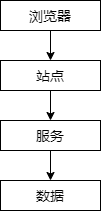

## 秒杀业务的特点

### QQ 业务的特点：细粒度数据查询

QQ 业务的核心数据结构

* 个人：*user(<span style="color:#FA6800;">uid</span>, user_info, ...)*
* 好友：*user_friends(<span style="color:#FA6800;">uid</span>, friend_id, ...)*
* 加入的群：*user_groups(<span style="color:#FA6800;">uid</span>, group_id, ...)*
* 群：*group(<span style="color:#FA6800;">gid</span>, group_info, ...)*
* 群成员：*group_members(<span style="color:#FA6800;">gid</span>, uid, ...)*
* 个人消息：*msgs_user(<span style="color:#FA6800;">msg_id</span>, uid, ...)*
* 群消息：*msgs_group(<span style="color:#FA6800;">msg_id</span>, gid, ...)*

QQ 的业务特点是，几乎所有的业务的读写都会带上 `uid`、`gid`、`msg_id` 这样的一些属性。比如说有一个业务要拉取用户的好友列表，那么它一定会带上 `uid`：

```sql
SELECT * FROM user_friends WHERE uid=?
```

这样一个业务在用户量非常大，并发量非常大的时候，它的锁冲突其实也是非常非常低的。在数据进行水平切分之后，每一个请求它都会带上 `uid`、`gid`、`msg_id` 这样的过滤字段，所以用户与用户之间是没有锁冲突的，就是我拉取我的群列表，你拉取你的群列表，根本不会有数据的锁冲突。只有当一个用户在很短的时间内有大量的并发的时候才可能有锁冲突，比如说同时 1s 钟有 10 个请求去拉取群信息，那么可能这 1s 钟的 10 个请求会有锁冲突。

这种类型的业务只要做好了水平切分和集群扩展，在架构上是可以很快的支持大数据量和高并发量的。

细粒度数据查询的锁冲突很小。

### 微博业务特点：读多写少，有少量读写冲突

微博的核心业务是 feed 流：

* 发消息，写操作
* 刷消息，读操作

微博业务显然是<span style="color:#FA6800;">读多写少</span>的，在用户刷消息时，<span style="color:#FA6800;">自己 feed 流里的消息，是由别人发的</span>。

自己查看自己主页的 feed 流，最朴素的实现方式：你得先拉取自己关注得用户 id 列表，对于这个用户列表查询他们最近发的消息，对于这些消息进行排序，返回第一页消息。feed 流本身有读扩散和写扩散等多种实现方式，但不是今天讨论的主题。无论是读扩散还是写扩散，在数据量很大并发很高时是有一些读写数据冲突的。

### 秒杀业务的特点：数据量少，写多读多，极大锁冲突

12306 的核心业务是：

* 查票，读操作
* 买票，写操作

*stock(id, num)* // 某一列车有多少张余票

在用户量很大，并发量很大时，<span style="color:#FA6800;">有极大的锁冲突</span>。

### 总结一下

QQ、微博、12306，它们的业务特点时不一样的，虽然同样是高并发的业务，但是它的难度是根据数据存储层的锁冲突决定的，锁冲突小，只要做水平扩展就可以提升性能。但是像 12306 它的数据不需要做水平切分，只有可能几千条数据，但是它的锁冲突极大，是不能够通过水平切分来解决的。同样是高并发业务，数据量不同，锁冲突不同，它的难度也不同。所以我们一定有一些优化方法，是微博、QQ 没有用到的，甚至是和常规架构优化方案、方向背道而驰的一些原则和方案。

## 架构上怎么优化？

**方向上“降低数据层锁冲突”，具体两大要点：**

* 降读：用缓存
* 降写：把请求拦截在系统上游

**用缓存降低数据层读请求，不展开**

秒杀买票，这是一个典型的<span style="color:#FA6800;">读多写少</span>的业务场景：

* 车次查询，读，量大
* 余票查询，读，量大
* 下单和支付，写，量小

一趟火车 2000 张票，200W 人同时来买，最多 2000 个人下单成功，其他人都是查询库存，写比例只有 0.1%，读比例占 99.9%，非常适合使用缓存来优化。

> 在不做特殊处理的情况下会有大量的写请求，但是将请求拦截在系统上游后，最终到达数据库的只有买票成功的那部分请求。像车次查询、余票查询都属于读请求，非常适合使用缓存来优化：在 Ngnix 层做页面的优化，在 Web 层做页面缓存，在服务层做数据的缓存等等。

如何将请求，拦截在系统上游？

先看看上下游分层架构



端上是浏览器层，包括浏览器、APP、H5 等。省略了反向代理层，因为它不是我们写的代码。站点层是我们写的页面，比如 PHP、Tomcat 等。服务是指服务层。数据是指数据层，包含缓存数据和数据库数据。

第一层，端上的请求拦截（浏览器/APP）

举个例子，微信摇一摇抢红包，摇一次微信就向后台发一次请求吗？肯定不是的，APP 会在端上做一些拦截策略。对浏览器和 H5 是相同的道理。

再举一个例子，抢票时用户点击了下单，系统会卡顿，故顾客很着急，他不自觉的会频繁点击下单。不但没有用，系统反而平白无故地多出了很多写请求，增加了系统的负载。假设平均一个用户点 5 次，其实只有一次时有效的，另外 4 次时给系统平白无故的增加负担，所以 80%、99.9% 的请求是这么多出来的。

因此在端上，在 JS 层面上可以做一些限速策略。可以限制用户在 x 秒内只能向系统提交一次请求，从而降低系统的负载。如果系统频繁的提交请求，可以友好的提示“频率过快”。

在端上的拦截只能够拦截普通用户，针对有技术功底的用户，通过抓包、F12 等方式获得请求数据，填入 cookie 等数据，直接跨过 JS，调用 http 接口向后端发送请求。

第二层，站点层的请求拦截

如何识别同一个用户？

用 ip 误伤太大，比如很多大学、很多公司对外的出口 ip 是有限的。

对与秒杀这类业务，用户需要登录，这时就能得到 `uid` 或 `token`，直接使用 `uid` 或 `token` 来标识用户。

在站点层做一个计数和限速，比如同一个 `uid` 每 5 秒钟只能通过 1 个请求到后端的服务层和数据层。其他的请求可以做页面缓存，粗暴的做法就是返回“速度过快”。

第三层，服务层的请求拦截

在这一层，我们知道业务库存，知道数据库的极限压力，就可以根据业务库存和数据库的抗压能力来进行削峰限速的。

比如手机的库存只有 1W 部，这时来了 10W 请求，同时将这些请求打到数据库上是没有意义的，这时候放过去 1W 个请求就行了。

比如压力测试结果显示数据库每秒只能扛 5000 个写请求，此时 10W 个 uid 的请求去抢票是没有任何意义的，这时候数据容易被打死，而且死了后还启不来，因为一启起来又被打死了，会有持续的雪崩。这时候放过去 5000 个请求就行了。

队列，无论是 MQ 集群还是服务器内存队列都可以，把所以的请求收集起来放到队列里，然后放过去一部分请求，根据业务库存和数据库抗压能力，比如 1K 个。服务层根据这 1K 个请求的返回情况，来决定后面是不是继续放请求，比如 1K 个都成功，再放过去 1K 个请求，假设其中 200 个失败了，没有库存了，队列中剩余的请求就每必要放过去了，全部返回库存不足。

第四层，数据库闲庭信步

请求有效性 100%。

两个最常问到的问题：

（1）按照上面的优化方案，其实<span style="color:#FA6800;">压力最大的反而是站点层</span>，假设真实有效的请求数是每秒 100W，这部分压力怎么处理？

站点层水平扩展是很方便的。加机器扩容。服务降级。抛弃部分请求。

（2）站点层限速，是每个 uid 的请求计数 Redis 里么？吞吐量很大的情况下，高并发访问 Redis，<span style="color:#FA6800;">网络带宽会不会成为瓶颈</span>？

首先，Redis 的性能非常高，一秒钟几十万是没有问题的。

其次，可以水平切分（扩展）Redis，每一个 Redis 去负责每一个时间段或每一个 uid 取模（每一个垂直切分的 uid）的计数，不要让所有的计数都放在同一个 Redis 实例里。

再次，可以不用 Redis，将计数放在站点层的内存里，这其实违反了站点层无状态的设计原则。如何保证同一个 uid 的请求落在同一个 Web 上？可以在 Ngnix 层做一个按照 uid 的路由方式，同一个 uid 路由到固定的某个 Web 站点上。这个计数对准确性和一致性要求不高，可以重新计数。

## 产品上如何优化？

任何脱离业务的架构设计都是耍流氓

产品 + 技术，不可分割

在技术架构那么难的情况下，有没有可能产品做一些折衷，去降低系统的复杂度呢？是可以的。

产品上，能够如何“优化”，以简化系统架构设计呢？

* 下单与支付分离

    **case 1**

    一般来说，下单和支付放在同一个流程里，能够提高转化率。

    对于秒杀场景，<span style="color:#FA6800;">产品上，下单流程和支付流程异步</span>，放在两个环节里，能够降低数据库写压力。

    12306，<span style="color:#FA6800;">下单成功后，系统占住库存，45 分钟之内支付即可</span>。

    （45 分钟之内未支付，被占住的库存会释放出来，在电商或秒杀业务中称为*回仓*）

* 分城市用户规则差异化

    **case 2**

    一般来说，所有用户规则相同，体验会更好。

    对于秒杀场景，产品上，<span style="color:#FA6800;">不同地域分时售票</span>，虽然不是所有用户规则相同，但能够极大降低系统压力。

    北京 9:00 开始售票，上海 9:30 开始售票，广州 XX 开始售票，能够分担系统压力。

* 按钮只能点一次

    **case 3**

    秒杀场景，由于短时间内并发较大，系统返回较慢，用户心情十分焦急，可能会频繁点击按钮，对系统造成压力。

    产品上可以优化为，一旦点击，<span style="color:#FA6800;">不管系统是否返回，按钮立即置灰</span>，不给用户机会频繁点击。

* 库存显示粒度加粗

    **case 4**

    一般来说，显示具体的库存数量，能够加强用户体验。

    对于秒杀场景，<span style="color:#FA6800;">产品上，只显示有/无车票，而不是显示具体票数目</span>，能够降低缓存淘汰率。

    显示库存会淘汰 N 次，显示有无只会淘汰 1 次。更多的，用户关注是否有票，而不是票有几张。

## 总结

一、**秒杀业务为什么难**？数据量并不大，但锁冲突巨大

二、**系统架构优化**，方向上，降低数据层锁冲突

（1）<span style="color:#FA6800;">降读：用缓存</span>

（2）<span style="color:#FA6800;">降写：把请求拦截在系统上游</span>

三、架构难度大，**产品要折衷**

## Q & A

Q：使用队列前端的请求是一直保持的吗？

A：服务层将请求放到队列里，一次只透了 1K 个请求到数据库，另外 9K 个请求请求在队列里，前端是没有得到返回的，站在用户的层面 Web 是没有返回的，所以前端请求是一直保持着的。但是，如果系统是处于死锁状态，前端请求会保持多久呢？Web 层如果一分半没有响应会断开，服务层一分半没有响应会断开，但是我们这么处理，可能一秒，两秒所有的余票都买完了，所有队列里的请求会返回票已售空，所以你的请求在浏览器层面只会 hold 2s 或 3s 钟，其实对用户的体验是非常好的。

Q：这种买票对用户是否公平的？

A：是公平的。先到队列里的请求，先买票。后面虽然只有 2s 或 3s 的时间，但是票卖完了，后面所有的用户都买不到票。所以是公平的。
